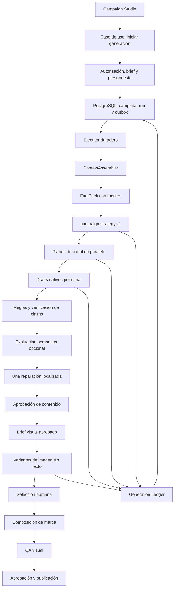

# Arquitectura De IA Y Orquestación De WIASocial

**Estado:** decisión técnica revisada y vigente  
**Revisión:** 2  
**Fecha:** 28 de julio de 2026  
**Ámbito:** Campaign Studio, contenido multicanal, imagen, memoria, evaluación, coste y automatización

## 1. Conclusión Ejecutiva

WIASocial no necesita una IA propia ni una colección de agentes que representen papeles. Necesita un **sistema editorial especializado dirigido por código**.

La arquitectura elegida combina:

1. Un flujo determinista y persistido por campaña.
2. Etapas de IA pequeñas, con entrada y salida tipadas.
3. Una estrategia común y generación nativa en paralelo para Instagram, Facebook, LinkedIn y X.
4. Memoria de marca recuperada por tarea, con fuentes y vigencia.
5. Reglas deterministas antes de cualquier evaluación semántica.
6. Una sola reparación automática localizada como máximo.
7. Aprobación humana antes de generar el arte final y antes de publicar.
8. Un proveedor de texto principal elegido mediante evaluación y un candidato en laboratorio.
9. Imagen generada sin texto importante y composición final controlada por WIASocial.
10. PostgreSQL como fuente de verdad y un ejecutor duradero para los trabajos largos.

La recomendación anterior acertaba al separar texto, imagen, memoria, validación y orquestación, pero introducía demasiadas piezas demasiado pronto. Esta revisión corrige cinco excesos:

- no habrá varios proveedores participando por defecto en cada campaña;
- no habrá arquitectura multiagente en el núcleo;
- los prompts empezarán versionados en Git, no en un gestor dinámico;
- `Trigger.dev` ejecutará trabajos, pero no será la fuente de verdad del flujo;
- `pgvector`, AI Gateway y fine-tuning se añadirán solo cuando una evaluación demuestre su valor.

## 2. Qué Existe Hoy

El sistema actual no implementa todavía esta arquitectura. El flujo real es:

```text
interfaz
  -> POST /api/ai
  -> contador mensual + contexto general del usuario
  -> prompt monolítico
  -> OpenAI o Gemini
  -> JSON sin esquema estricto
  -> respuesta HTTP
  -> guardado posterior desde el navegador
```

Evidencias en el repositorio:

- `src/app/api/ai/route.ts:31-41` fija un modelo por defecto, usa JSON mode y temperatura global.
- `src/app/api/ai/route.ts:245-269` consume una unidad antes de validar y ejecutar la generación.
- `src/app/api/ai/route.ts:273-414` concentra trece acciones en una única ruta.
- La acción `content` solicita estrategia, piezas, carrusel, stories, DM, visual y autoevaluación en una sola llamada.
- `src/lib/ai-context.ts:77` construye un contexto general para tareas distintas.
- `src/lib/ai-client.ts:20` mantiene la petición abierta hasta recibir la generación completa.
- `src/lib/db.ts:383` guarda la salida desde el cliente después de completar la petición.
- Once rutas adicionales fijan `gpt-4o-mini` directamente.
- `scripts/model-bakeoff.mjs` compara proveedores, pero usa cinco casos de Instagram, una ejecución por caso y la puntuación del mismo modelo como métrica principal.

### 2.1. Riesgos Del Diseño Actual

| Riesgo | Consecuencia |
|---|---|
| Una llamada hace demasiados trabajos | Un fallo o una mala decisión contamina todo el paquete |
| JSON mode sin esquema estricto | La salida puede ser JSON válido y aun así incumplir el contrato |
| Autoevaluación del generador | La puntuación no aporta independencia ni verdad de referencia |
| Contexto general para cada tarea | Más coste, ruido, exposición de datos y superficie de inyección |
| Todo el contexto se etiqueta como confiable | Captions y texto importado pueden confundirse con instrucciones |
| Petición HTTP síncrona | Esperas largas, sensación de bloqueo y pérdida del trabajo al cortar la conexión |
| Guardado desde el navegador | Puede existir coste de proveedor sin registro durable de la ejecución |
| Un crédito por petición | No representa el coste real de una campaña con varios pasos e imágenes |
| Modelos repartidos entre rutas | Cambiar, probar o retirar un modelo exige tocar muchos archivos |
| Fallback implícito y parcial | Es difícil saber qué proveedor produjo el resultado y por qué |

## 3. Patrones Comparados

### 3.1. Llamada Única

Un prompt recibe todo el contexto y devuelve la campaña completa.

**Ventajas:** implementación rápida, una sola latencia de red y coste inicial bajo.  
**Problemas:** baja observabilidad, contratos grandes, reparación torpe, poca especialización y evaluación difícil.  
**Decisión:** conservar solo para tareas atómicas, como clasificar una señal o proponer cinco hooks.

### 3.2. Cadena Determinista

El código define etapas y cada llamada resuelve una tarea concreta. Se añaden controles entre etapas.

**Ventajas:** contratos pequeños, reintentos localizados, trazabilidad y mejor evaluación.  
**Problemas:** más llamadas y algo más de latencia.  
**Decisión:** es el patrón principal de WIASocial.

Anthropic distingue los workflows, con caminos definidos por código, de los agentes que deciden dinámicamente sus pasos. También recomienda comenzar por la solución más simple y aumentar la complejidad solo cuando la mejora sea medible. Su patrón de prompt chaining encaja directamente con estrategia, copy y validación. Fuente: [Building effective agents](https://www.anthropic.com/engineering/building-effective-agents).

### 3.3. Enrutado

Clasifica el trabajo y elige una tarea, prompt o capacidad especializada.

**Uso correcto en WIASocial:** seleccionar contrato de canal, tipo de pieza, nivel de calidad o modelo ya homologado.  
**Uso incorrecto:** pedir a otro LLM que elija libremente proveedor, presupuesto y flujo en cada petición.  
**Decisión:** enrutado determinista por configuración y reglas de negocio.

### 3.4. Paralelización

Ejecuta subtareas independientes a la vez.

**Uso correcto:** generar los planes de Instagram, Facebook, LinkedIn y X a partir de la misma estrategia aprobada.  
**Uso incorrecto:** pedir cuatro respuestas iguales y votar siempre, porque multiplica el coste.  
**Decisión:** paralelización por canal y, de forma excepcional, variantes visuales.

### 3.5. Evaluador Y Optimizador

Un generador produce, un evaluador señala defectos y una reparación corrige lo necesario.

**Ventajas:** puede mejorar textos donde los criterios son claros.  
**Riesgos:** bucles caros, jueces inconsistentes y degradación por reescrituras repetidas.  
**Decisión:** reglas duras primero, evaluación semántica después y una reparación automática como máximo.

### 3.6. RAG O Recuperación De Conocimiento

Recupera datos relevantes antes de generar. No es un agente ni una base de datos vectorial por definición.

**Uso correcto:** hechos aprobados, pruebas, restricciones, voz y ejemplos de una marca.  
**Decisión:** sí desde el primer corte, empezando por filtros y búsqueda de texto en PostgreSQL. La búsqueda semántica e híbrida se incorporará cuando el volumen y las pruebas lo justifiquen. Supabase documenta tanto `pgvector` como la combinación de búsqueda léxica y semántica. Fuentes: [búsqueda semántica](https://supabase.com/docs/guides/ai/semantic-search) y [búsqueda híbrida](https://supabase.com/docs/guides/ai/hybrid-search).

### 3.7. Agente Autónomo

El modelo decide qué pasos dar, qué herramientas usar y cuándo terminar.

**Buen encaje:** investigación abierta, diagnóstico conversacional o tareas cuyo camino no puede predecirse.  
**Mal encaje:** creación de una campaña con fases, formatos, límites y aprobaciones conocidos.  
**Decisión:** fuera del núcleo. Podría existir más adelante como asistente de investigación, aislado y sin permiso de publicación.

### 3.8. Multiagente

Varios agentes se delegan tareas y sintetizan resultados.

**Ventaja potencial:** problemas grandes con líneas de trabajo realmente independientes.  
**Problemas:** coste, latencia, errores compuestos, trazas complejas y falsa sensación de especialización por asignar nombres de rol. OpenAI mantiene su capacidad multiagente como beta y recomienda probarla sobre tareas representativas. Fuente: [guía actual de modelos de OpenAI](https://developers.openai.com/api/docs/guides/latest-model).

**Decisión:** no usar en el MVP de Campaign Studio.

### 3.9. Fine-tuning

Ajusta un modelo con ejemplos de entrada y salida deseada.

**Buen encaje futuro:** un formato repetible, suficientes ejemplos corregidos y una evaluación estable.  
**Mal encaje actual:** pocas aprobaciones, estrategia cambiante, hechos por marca y ausencia de una métrica fiable. OpenAI indica que deben existir evaluaciones antes de invertir en ajuste y recomienda comenzar con demostraciones bien elaboradas; además, su plataforma actual de fine-tuning se está retirando para nuevos usuarios. Fuente: [supervised fine-tuning](https://developers.openai.com/api/docs/guides/supervised-fine-tuning).

**Decisión:** no usar ahora. El primer aprendizaje será recuperación de ejemplos aprobados y preferencias explícitas.

## 4. Decisión De Arquitectura

La arquitectura de WIASocial será un **workflow editorial determinista, persistido, multicanal y asistido por modelos**.

| Dimensión | Decisión |
|---|---|
| Razonamiento | Cadena determinista por etapas |
| Autonomía | Baja en generación; nula en publicación |
| Paralelismo | Por canal y por variante visual |
| Memoria | Hechos y ejemplos recuperados por tarea |
| Contratos | Esquemas versionados y validados en servidor |
| Proveedores | Uno principal en producción; candidatos en evaluación |
| Calidad | Reglas, comprobación de fuentes, evaluación semántica y humano |
| Persistencia | PostgreSQL antes y después de cada paso |
| Ejecución | Trabajo duradero para campañas e imágenes |
| Integraciones | Adaptadores internos y n8n en el borde |
| Aprendizaje | Feedback estructurado; no autoentrenamiento |

## 5. Arquitectura Objetivo



### 5.1. No Son Agentes

`campaign.strategy.v1`, `channel.instagram.plan.v1` o `copy.linkedin.post.v1` son **tareas tipadas**, no personas simuladas ni procesos autónomos. Cada tarea tiene:

- una finalidad única;
- un esquema de entrada;
- una política de contexto;
- una plantilla de prompt versionada;
- una clase de modelo autorizada;
- un esquema de salida;
- un presupuesto y timeout;
- reglas de calidad;
- un límite de reintentos.

### 5.2. Contrato De Tarea

```ts
interface AITaskSpec<TInput, TOutput> {
  id: string;
  version: number;
  inputSchema: Schema<TInput>;
  outputSchema: Schema<TOutput>;
  contextPolicy: ContextPolicy;
  modelClass: "economy" | "standard" | "premium" | "image";
  maxCostUsd: number;
  timeoutMs: number;
  maxAttempts: number;
  buildPrompt(input: TInput, context: ContextSnapshot): ModelPrompt;
}
```

Los prompts estarán inicialmente en TypeScript o archivos de texto del repositorio. La versión de tarea, el hash del prompt y el commit se guardarán en cada ejecución. Un editor de prompts en base de datos solo tendrá sentido cuando exista un proceso real de experimentación, permisos y reversión.

## 6. Flujo De Generación

### 6.1. Iniciar

`POST /api/campaigns/{id}/generation-runs` hará únicamente:

1. autenticar y autorizar el `workspace` y la marca;
2. validar el brief con un esquema;
3. calcular el presupuesto máximo;
4. reservar créditos internos;
5. crear `generation_run` y evento `outbox` en la misma transacción;
6. devolver `202 Accepted` con `run_id`.

La interfaz mostrará el avance por pasos. No necesita mantener abierta una petición durante toda la generación.

### 6.2. Preparar Contexto

El `ContextAssembler` construirá un snapshot mínimo para la tarea. No enviará todo el historial a todos los modelos.

```text
brief validado
+ hechos aprobados y vigentes
+ pruebas y claims permitidos
+ restricciones y claims prohibidos
+ perfil de voz
+ dos o tres ejemplos relevantes
+ señales de rendimiento agregadas
+ reglas del canal
= ContextSnapshot inmutable
```

Cada fragmento llevará `source_id`, clase, estado, fecha y confianza. El texto importado desde redes, URLs o documentos se tratará como **datos no confiables**, nunca como instrucciones.

### 6.3. Estrategia

La estrategia devolverá únicamente:

- objetivo y audiencia concreta;
- tensión o problema;
- ángulo y concepto;
- oferta y acción deseada;
- mapa de claims a fuentes;
- canales recomendados y función de cada uno;
- dirección visual inicial;
- riesgos y supuestos.

No redactará todavía todos los posts. Así se puede aprobar o corregir una decisión importante antes de multiplicarla.

### 6.4. Planes Y Copy Por Canal

Tras aprobar o aceptar automáticamente la estrategia según el modo del producto:

- cada canal recibe la estrategia, no el copy de Instagram;
- los planes independientes se ejecutan en paralelo;
- cada contrato expresa formatos y límites propios;
- el copy se produce por pieza, no como un paquete JSON gigante;
- una regeneración afecta solo a la pieza seleccionada.

### 6.5. Quality Gate

Orden obligatorio:

1. Validación de esquema.
2. Reglas de formato y canal.
3. Comprobación de claims y fuentes.
4. Detección de duplicación y contradicciones.
5. Evaluación semántica si aporta valor medido.
6. Reparación localizada una vez.
7. Aprobación o revisión humana.

| Hallazgo | Acción |
|---|---|
| Claim material sin fuente | Bloquear |
| Promesa prohibida | Bloquear |
| Formato incompatible | Bloquear |
| Contradicción con la oferta | Bloquear |
| Copy prácticamente igual entre canales | Reparar |
| Tono o claridad mejorables | Avisar o reparar una vez |
| Preferencia estética | Mostrar al usuario |

El evaluador no calculará una nota decorativa de 0 a 100. Devolverá hallazgos tipados, evidencia, severidad y ubicación. No verá la autoevaluación del generador.

### 6.6. Imagen Y Composición

La imagen se genera después de validar el concepto y, por defecto, después de aprobar el contenido. Esto evita pagar recursos visuales para una idea que el usuario va a rechazar.

```text
estrategia aprobada
  -> brief visual estructurado
  -> 2 a 4 borradores de bajo coste
  -> selección humana
  -> generación o edición final
  -> compositor determinista
  -> OCR, contraste, zonas seguras y dimensiones
  -> aprobación
```

El modelo visual genera fotografía, ilustración, fondo o recurso. WIASocial añade tipografía, logo, colores, jerarquía, CTA y numeración. El texto importante no se delegará al modelo de imagen.

Los proveedores visuales competirán por tipo de trabajo, no por una nota global. Los primeros candidatos siguen siendo GPT Image, Gemini y Recraft. Fuentes: [OpenAI Image generation](https://developers.openai.com/api/docs/guides/image-generation), [Gemini image generation](https://ai.google.dev/gemini-api/docs/image-generation) y [Recraft API](https://www.recraft.ai/docs/api-reference/endpoints).

## 7. Modelos Y Proveedores

### 7.1. Política

WIASocial no codificará modelos en las rutas. Utilizará alias de capacidad:

```text
TEXT_PREMIUM_PRIMARY
TEXT_STANDARD_PRIMARY
TEXT_ECONOMY_PRIMARY
TEXT_EVALUATOR
IMAGE_PHOTO_PRIMARY
IMAGE_DESIGN_PRIMARY
```

Cada alias apuntará a un modelo homologado y, cuando el proveedor lo permita, a una versión fijada. El enrutado será determinista por tarea, plan y presupuesto.

### 7.2. Producción Frente A Laboratorio

**Producción:** un proveedor principal por capacidad y un fallback comparable ya evaluado.  
**Laboratorio:** modelos candidatos, ejecuciones sombra y bake-offs.  
**Prohibido:** enviar cada campaña a tres proveedores y sintetizar por defecto.

Un fallback solo ocurre en el límite de un paso completo. Se registra el proveedor real y no se mezcla una respuesta parcial con otra. Si ningún modelo homologado puede completar el contrato, el paso falla de forma visible.

### 7.3. Elección Inicial

No se debe decidir hoy el ganador por reputación o benchmark público. El conjunto inicial comparará:

- un candidato premium de OpenAI;
- un candidato premium de Anthropic;
- un candidato eficiente de OpenAI o Gemini;
- los proveedores visuales por clase de activo.

La guía actual de OpenAI recomienda elegir esfuerzo y modelo mediante pruebas representativas, no asumir que el máximo razonamiento es siempre mejor. Fuente: [Model guidance](https://developers.openai.com/api/docs/guides/latest-model).

## 8. Capa De Acceso A Modelos

### 8.1. AI SDK Core

**Recomendación:** usar Vercel AI SDK Core dentro de la infraestructura de IA, no como contrato del dominio.

Encaja con Next.js y TypeScript, normaliza proveedores y permite generar objetos validados con esquemas. También ofrece registro de proveedores y middleware. Fuentes: [structured data](https://ai-sdk.dev/docs/ai-sdk-core/generating-structured-data), [provider registry](https://ai-sdk.dev/docs/reference/ai-sdk-core/provider-registry) y [middleware](https://ai-sdk.dev/docs/ai-sdk-core/middleware).

Límite importante: una API unificada no elimina las diferencias de razonamiento, caching, imágenes, errores o metadatos. Por eso el dominio dependerá de `TextGenerator`, `ImageGenerator` y `ModelResult`, no de tipos de AI SDK.

### 8.2. Structured Outputs

Todos los pasos estructurados usarán esquema estricto y validación en servidor. JSON mode no basta: garantiza JSON válido, pero no que respete el esquema. OpenAI recomienda Structured Outputs cuando esté disponible. Fuente: [Structured Outputs](https://developers.openai.com/api/docs/guides/structured-outputs).

**Qué no puede exigir un esquema estricto.** "Estricto" cubre la forma, no el rango. Ningún proveedor evaluado valida restricciones numéricas (`minimum`, `maximum`, `multipleOf`) ni de longitud (`minLength`, `maxLength`); Anthropic tampoco admite esquemas recursivos y exige `additionalProperties: false`; Gemini soporta un subconjunto de JSON Schema. En la práctica, un porcentaje fuera de rango, una paleta con demasiados colores o una lista vacía donde se esperaba contenido pasan el esquema y llegan al dominio.

Por eso la validación de servidor no es un respaldo del esquema sino una capa distinta: el esquema garantiza que el objeto tiene la forma esperada, y la validación de negocio garantiza que los valores son admisibles. Las dos son obligatorias y ninguna sustituye a la otra.

### 8.3. AI Gateway

Vercel AI Gateway ofrece enrutado, fallbacks, observabilidad y presupuestos centralizados sin markup publicado. Fuentes: [modelos y proveedores](https://vercel.com/docs/ai-gateway/models-and-providers), [opciones de proveedor](https://vercel.com/docs/ai-gateway/models-and-providers/provider-options) y [precios](https://vercel.com/docs/ai-gateway/pricing).

**Decisión:** no es requisito del MVP. Primero se medirán dos adaptadores directos. Se evaluará cuando el coste operativo de claves, fallback y reporting sea mayor que introducir otro procesador de datos y dependencia externa.

## 9. Orquestación Y Trabajos Duraderos

La orquestación de negocio y el ejecutor no son lo mismo:

- PostgreSQL decide en qué estado está la campaña y qué artefactos existen.
- El ejecutor toma trabajos, aplica concurrencia y reintentos y actualiza el estado.
- La `outbox` evita perder un trabajo entre la transacción y la cola.

### 9.1. Trigger.dev

**Recomendación:** usar Trigger.dev para generación de campañas, imágenes, composición e informes cuando salgan de HTTP.

Aporta tareas TypeScript, colas, concurrencia por tenant, idempotencia, reintentos y checkpointing. Fuentes: [idempotencia](https://trigger.dev/docs/idempotency), [colas y concurrencia](https://trigger.dev/docs/queue-concurrency) y [ejecución duradera](https://trigger.dev/docs/how-it-works).

No se suspenderá una ejecución durante días esperando la aprobación humana. Aunque Trigger.dev ofrece waitpoints, su cloud publica un TTL máximo de catorce días para runs. La campaña quedará en `awaiting_approval` en PostgreSQL y la aprobación iniciará un run nuevo. Fuentes: [waitpoints](https://trigger.dev/docs/wait-for-token) y [límites](https://trigger.dev/docs/limits).

### 9.2. LangGraph Y Frameworks De Agentes

LangGraph aporta persistencia, ejecución duradera y human-in-the-loop para agentes con estado. Fuente: [LangGraph overview](https://docs.langchain.com/oss/python/langgraph/overview).

**Decisión:** no incorporarlo. WIASocial ya conoce el grafo, usa TypeScript y no necesita un bucle donde el modelo elija los nodos. Añadir LangGraph junto a PostgreSQL y Trigger.dev duplicaría responsabilidades.

### 9.3. n8n

**Sí:** CRM, Slack, Teams, Drive, correo, formularios, webhooks y recetas internas.  
**No:** prompts, memoria, aprobación, publicación crítica, saldos, estado canónico o Quality Gate.

n8n consumirá la API pública y eventos firmados de WIASocial. Si se alojan flujos o credenciales de clientes, n8n indica que se necesita una licencia Enterprise; si se expone su editor dentro del producto, una licencia Embed. Fuente: [criterios de licencia de n8n](https://support.n8n.io/article/can-i-use-your-license-for-my-use-case).

## 10. Persistencia

### 10.1. Tablas Mínimas

| Tabla | Responsabilidad |
|---|---|
| `generation_runs` | Una solicitud de generación visible al usuario |
| `generation_steps` | Estado e intentos de cada tarea |
| `generation_artifacts` | Estrategias, planes, copys, briefs y assets versionados |
| `usage_events` | Tokens, imágenes, coste y reserva o liquidación |
| `quality_findings` | Hallazgos deterministas y semánticos |
| `content_feedback` | Aprobación, rechazo, edición y motivo |
| `brand_sources` | Documento, URL o material de origen |
| `brand_facts` | Hechos, claims, restricciones y vigencia |
| `outbox_events` | Entrega fiable de trabajos y eventos |

### 10.2. Estados Separados

No se mezclará la vida de una campaña con la de una llamada de IA.

```text
generation_run:
queued -> running -> completed
                  -> failed
                  -> cancelled

generation_step:
queued -> running -> succeeded
                  -> retry_scheduled -> running
                  -> failed
                  -> skipped

campaign:
draft -> generating_content -> awaiting_content_approval
      -> generating_visuals -> awaiting_visual_approval
      -> ready -> scheduled -> active -> completed
```

Una ejecución fallida se podrá reanudar desde el último artefacto válido. Una regeneración crea una nueva versión y conserva su linaje.

## 11. Coste Y Créditos

El contador actual de una unidad por petición no sirve para una campaña de varias llamadas.

El modelo nuevo separará:

- **crédito comercial:** lo que el plan muestra al cliente;
- **reserva:** coste máximo autorizado antes de empezar;
- **uso real:** coste registrado por cada intento del proveedor;
- **liquidación:** diferencia entre reserva y uso;
- **margen:** ingreso asignado menos coste real.

Reglas:

1. Reservar antes de encolar.
2. Registrar intentos fallidos porque algunos proveedores los facturan.
3. Liberar la parte no consumida.
4. Limitar coste por tarea, run, día y workspace.
5. Alertar por desviación, no solo por volumen.
6. Medir coste por pieza aceptada, no únicamente por token.
7. Agotar el rango de esfuerzo del modelo actual antes de escalar a un alias más caro.

La regla 7 importa porque el parámetro de esfuerzo es la palanca de coste más barata disponible y suele ignorarse. Un modelo no es un punto de precio sino una curva: separar dos tramos de esfuerzo cambia el gasto más que cambiar de proveedor, y la calidad no siempre acompaña al tramo alto. El esfuerzo se fija por tarea, se registra junto al uso y se barre en el bake-off como una dimensión más, no como una constante.

El prompt caching se aprovechará cuando exista un prefijo estable y el proveedor lo soporte. Se registrarán lecturas y escrituras de caché. No se diseñará el negocio suponiendo una tasa de acierto teórica.

Dos condiciones que un prefijo estable no garantiza por sí solo:

- **Longitud mínima.** Cada modelo tiene un umbral por debajo del cual no cachea, y no lo señala: 512 tokens en el tramo alto de Anthropic, 1.024 en el medio y 4.096 en el económico. Un prefijo puede ser perfectamente estable y quedar por debajo del suyo, en cuyo caso las lecturas de caché son cero de forma permanente.
- **Orden.** El prefijo se compone de estable a volátil: marca, hechos y contrato primero; brief, fecha e identificadores de ejecución al final. Un identificador de generación al principio invalida la caché en cada petición sin producir ningún error.

Ambas se comprueban leyendo las métricas de caché registradas, no asumiendo que la configuración es correcta.

## 12. Seguridad Y Privacidad

### 12.1. Contexto

- Cada tarea declara los tipos de dato que puede recibir.
- El texto importado se delimita como contenido, nunca como instrucciones.
- No se envían tokens sociales, secretos, datos de pago ni leads identificables salvo necesidad explícita.
- Se utilizan agregados cuando basten para decidir.
- Los snapshots se aíslan por `workspace_id` y `brand_id`.
- Las fuentes y permisos se comprueban en servidor.

### 12.2. Trazas

Se registrarán metadatos, hashes y resultados estructurados. El prompt completo no se enviará por defecto a telemetría externa. AI SDK permite desactivar la captura de entradas y salidas en sus trazas, una precaución necesaria si se usa su telemetría experimental. Fuente: [AI SDK Telemetry](https://ai-sdk.dev/docs/ai-sdk-core/telemetry).

### 12.3. Acciones

- Ningún modelo tiene credenciales de publicación.
- Los modelos proponen; el dominio valida y ejecuta.
- Publicar exige una versión aprobada e idempotency key.
- Los webhooks y eventos externos no alteran prompts ni memoria sin validación.
- Las decisiones y publicaciones quedan auditadas.

## 13. Evaluación

### 13.1. Qué Debe Cambiar En El Bake-off

El runner actual es útil para verificar conectividad y contratos de proveedor, pero no elige un ganador fiable. Se cambiará así:

- evaluar tareas separadas, no un paquete gigante;
- retirar `qualityReview.score` de la salida del candidato;
- ampliar a veinte briefs iniciales y cuatro canales;
- ejecutar dos veces cada combinación para medir variabilidad;
- anonimizar y aleatorizar las salidas;
- contar con dos revisores cuando sea posible;
- añadir referencias humanas y casos adversariales;
- registrar uso real, coste y latencia p50 y p95;
- conservar un conjunto reservado para la decisión final.

**Los parámetros de sampling no son equiparables entre proveedores.** Los modelos Claude de generación 5 rechazan `temperature`, `top_p` y `top_k` con un error 400, mientras que OpenAI y Gemini los aceptan. Fijar temperatura en unos y no en otros no produce una comparación homóloga, y "ejecutar dos veces cada combinación para medir variabilidad" no significa lo mismo en ambos casos: en unos la variabilidad se induce por sampling y en otros es la del modelo con su configuración por defecto.

La equiparación se define por **nivel de esfuerzo y longitud de razonamiento observada**, no por parámetros de sampling. La configuración exacta de cada candidato se registra junto al resultado, de modo que la comparación sea auditable después.

OpenAI propone definir la tarea, ejecutarla sobre datos de prueba representativos y analizar los resultados antes de iterar. También admite etiquetas humanas como verdad de referencia. Fuente: [Working with evals](https://developers.openai.com/api/docs/guides/evals).

### 13.2. Métricas

| Métrica | Peso inicial |
|---|---:|
| Publicable con cambios menores | 25 % |
| Fidelidad a hechos y restricciones | 20 % |
| Adecuación nativa al canal | 15 % |
| Estrategia y capacidad comercial | 15 % |
| Especificidad y voz de marca | 10 % |
| Tiempo y distancia de edición | 10 % |
| Coste y latencia | 5 % |

Los fallos factuales, legales, de formato o de aislamiento invalidan la salida aunque su media sea alta.

### 13.3. Jueces De IA

Un LLM puede ayudar a detectar regresiones, pero no será la verdad de referencia. Antes de usarlo:

1. se calibra contra decisiones humanas;
2. se mide su acuerdo por criterio;
3. no evalúa su propia salida;
4. devuelve evidencia y no solo una nota;
5. los desacuerdos importantes van a revisión humana.

### 13.4. Métrica De Producto

La métrica principal será:

```text
porcentaje de piezas aceptadas con cambios menores
```

Métricas auxiliares:

- tiempo hasta aprobación;
- porcentaje de regeneraciones;
- edición por bloque;
- coste por pieza aceptada;
- campañas publicadas;
- señales y resultados vinculados.

Likes, alcance o leads no entrenarán el sistema automáticamente. Están afectados por audiencia, inversión, fecha, distribución y oferta. Se usarán como evidencia contextual, no como etiqueta limpia de calidad.

## 14. Aprendizaje Y Personalización

### Etapa 1. Declarativo

Hechos, tono, ejemplos, restricciones y preferencias introducidos o aprobados por el usuario.

### Etapa 2. Recuperación

Seleccionar ejemplos aceptados parecidos por canal, objetivo, audiencia y formato. Primero con filtros y texto; después con búsqueda híbrida si mejora los resultados.

### Etapa 3. Preferencias

Aprender patrones explícitos de edición:

- titulares acortados;
- palabras eliminadas;
- intensidad comercial preferida;
- estructuras aceptadas;
- motivos de rechazo.

### Etapa 4. Optimización De Modelo

Solo se abre cuando existen:

- al menos cientos de ejemplos de calidad y derechos claros;
- conjunto de evaluación estable;
- mejora insuficiente con prompts, contexto y recuperación;
- tarea repetible y proveedor compatible;
- retorno económico medible.

## 15. Roadmap Técnico

### Fase IA-0. Medición Y Contratos

**Objetivo:** conocer la calidad y el coste actuales antes de cambiar modelos.

- definir esquemas de brief, estrategia y una pieza por canal;
- separar el bake-off por tareas;
- crear veinte casos iniciales y rúbrica humana;
- registrar una línea base de la implementación actual;
- eliminar del benchmark la autoevaluación.

**Salida:** baseline reproducible con calidad, fallos, latencia y coste.

### Fase IA-1. Núcleo Síncrono Bien Formado

**Objetivo:** corregir contratos y acoplamiento sin introducir todavía la cola.

- crear `AITaskRegistry` con prompts versionados en Git;
- añadir esquemas de entrada y salida;
- introducir `ContextAssembler` por tarea;
- centralizar alias de modelos;
- integrar AI SDK Core detrás de adaptadores propios;
- guardar `generation_run`, pasos y uso en servidor;
- migrar primero la acción `content`.

**Salida:** una generación de texto es trazable, validada y persistida aunque falle el navegador.

### Fase IA-2. Pipeline De Contenido

**Objetivo:** sustituir la llamada monolítica por estrategia y copy nativo.

- generar y validar `FactPack`;
- separar estrategia de planes de canal;
- paralelizar canales seleccionados;
- implementar reglas y claims;
- añadir una reparación localizada;
- permitir regenerar una pieza sin rehacer la campaña;
- ejecutar el bake-off y elegir proveedor principal.

**Salida:** cuatro canales nativos y una mejora humana demostrada frente al baseline.

### Fase IA-3. Ejecución Duradera

**Objetivo:** evitar bloqueos y soportar trabajos largos.

- añadir `outbox_events`;
- integrar Trigger.dev detrás de `JobRunner`;
- aplicar idempotencia y concurrencia por workspace;
- progreso en tiempo real, cancelación y reanudación;
- liquidación de coste real.

**Salida:** cortar o recargar el navegador no pierde el run ni duplica gasto.

### Fase IA-4. Pipeline Visual

**Objetivo:** crear recursos visuales útiles y arte final controlado.

- contratos de brief y asset;
- benchmark por clase de imagen;
- borradores, selección y final;
- almacenamiento privado;
- compositor de marca;
- QA visual y revisión móvil.

**Salida:** imagen, copy y composición mantienen el mismo concepto y son editables.

### Fase IA-5. Aprendizaje E Integraciones

**Objetivo:** convertir decisiones reales en ventaja de producto.

- feedback estructurado y comparación de versiones;
- recuperación de ejemplos aprobados;
- pruebas de búsqueda híbrida;
- ejecuciones sombra para modelos candidatos;
- API y eventos para n8n;
- evaluar AI Gateway con datos de operación reales.

**Salida:** la personalización mejora la aceptación sin romper hechos ni margen.

## 16. Decisiones Cerradas

- Workflow determinista como arquitectura principal.
- Sin multiagente en Campaign Studio.
- Sin fine-tuning en el MVP.
- Estrategia común y copy nativo por canal.
- RAG básico con fuentes desde el primer corte.
- Texto e imagen separados.
- Composición tipográfica controlada por WIASocial.
- Esquemas estrictos en todas las tareas nuevas.
- Un proveedor principal por capacidad.
- PostgreSQL como estado canónico.
- Trigger.dev como ejecutor provisional de trabajos largos.
- n8n solo como capa de integraciones.
- Aprobación humana antes de publicar.
- Coste por paso y por pieza aceptada.

## 17. Decisiones Pendientes De Evidencia

- proveedor y modelo ganador para estrategia;
- proveedor y modelo ganador para copy por canal;
- necesidad real de un evaluador LLM en cada campaña o solo en planes premium;
- proveedor visual por fotografía, ilustración y diseño;
- número óptimo de borradores visuales;
- momento en que la búsqueda semántica supera a filtros y texto;
- valor operativo de AI Gateway;
- coste contractual de n8n si aloja credenciales de clientes;
- umbral de datos que justificaría optimización específica de modelo.

Estas decisiones no bloquean la arquitectura. El sistema está diseñado para responderlas con resultados medidos, no con preferencias de proveedor.

## 18. Anexo: Candidatos Para El Cribado

Este anexo alimenta la elección inicial de §7.3 y las decisiones pendientes de §17. **No fija ganadores ni sustituye al bake-off**, y no debe leerse como una matriz de enrutado: los alias de §7.1 siguen siendo el contrato. Es la lista de a quién merece la pena invitar a la evaluación, con el precio de catálogo como criterio de entrada.

Datos verificados en julio de 2026. Precios por millón de tokens, tarifa plena publicada.

### Tramo premium — `TEXT_PREMIUM_PRIMARY`

| Candidato | Entrada | Salida | Nota |
|---|---:|---:|---|
| `gemini-3.1-pro` | 2 USD | 12 USD | El más barato del tramo. Tarifa escalada a 4/18 por encima de 200K de contexto. Mejor seguimiento de instrucciones publicado del tramo frontera, que para este producto pesa más que la puntuación de escritura creativa, porque el pipeline restringe al modelo con brief, hechos y contratos. |
| `gpt-5.6-terra` | 2,50 USD | 15 USD | |
| `claude-sonnet-5` | 3 USD | 15 USD | Su tokenizer produce en torno a un 30 % más de tokens que la generación anterior para el mismo texto; las estimaciones antiguas no son reutilizables. |

### Tramo techo — activación excepcional con presupuesto explícito

| Candidato | Entrada | Salida | Nota |
|---|---:|---:|---|
| `claude-opus-5` | 5 USD | 25 USD | Encabeza el leaderboard de escritura creativa de EQ-Bench y cuesta menos en salida que la alternativa de OpenAI. |
| `gpt-5.6-sol` | 5 USD | 30 USD | |

### Tramo económico — `TEXT_ECONOMY_PRIMARY`

| Candidato | Entrada | Salida | Nota |
|---|---:|---:|---|
| `gemini-3.5-flash-lite` | 0,30 USD | 2,50 USD | El más barato en ambas direcciones. |
| `claude-haiku-4-5` | 1 USD | 5 USD | Más barato en salida que las alternativas de OpenAI y Gemini. Umbral de caché de 4.096 tokens: con prompt corto no cachea, lo que empeora su economía real frente a esta tabla. |
| `gpt-5.6-luna` | 1 USD | 6 USD | |
| `gemini-3.6-flash` | 1,50 USD | 7,50 USD | |

### Visual

`gpt-image-2` lidera hoy los leaderboards públicos de generación general y es el candidato de partida para `IMAGE_PHOTO_PRIMARY`, junto con `gemini-3.1-flash-image`. Para `IMAGE_DESIGN_PRIMARY`, Recraft V4.1 como especialista en estilo de marca, vectores e iconografía, e Ideogram 4 cuando el texto forme parte real de la escena. Imagen de Google se retira el 17 de agosto de 2026 y no se integra.

### Descartados, con motivo

| Candidato | Motivo |
|---|---|
| `kimi-k3` (Moonshot AI) | Segundo en escritura creativa, pero el esfuerzo de razonamiento está bloqueado en el máximo y esos tokens se facturan como salida, de modo que el coste real supera con holgura el de catálogo. Además es un proveedor chino: procesar datos de clientes europeos exigiría un análisis de transferencias desproporcionado para el MVP. |
| `muse-spark-1.1` (Meta) | El más barato en salida del tramo económico, pero la preview está limitada a desarrolladores de Estados Unidos y no es utilizable desde la Unión Europea. Se revisará más adelante. |
| `gemini-3.5-pro` | No ha llegado a disponibilidad general. A 22 de julio de 2026 sigue en preview limitada de Vertex tras saltarse varias fechas anunciadas. Se revisará cuando sea estable. |

### Advertencias sobre este anexo

- **`claude-sonnet-5` tiene tarifa introductoria de 2/10 hasta el 31 de agosto de 2026.** La comparación de coste se hace con la tarifa plena de 3/15: elegirlo por el precio de la ventana implica una subida del 50 % en septiembre.
- **Los precios proceden en su mayoría de agregadores, no de las páginas oficiales.** Se confirman contra la tarifa del proveedor antes de comprometer una decisión.
- **Ningún benchmark público mide esta tarea.** Los leaderboards de escritura puntúan prosa y voz de personaje en inglés; aquí se genera copy sujeto a un brief, a hechos verificables y a restricciones de marca, en español, con aprobación humana posterior. Este anexo sirve para decidir a quién se invita al cribado, nunca para saltárselo.
