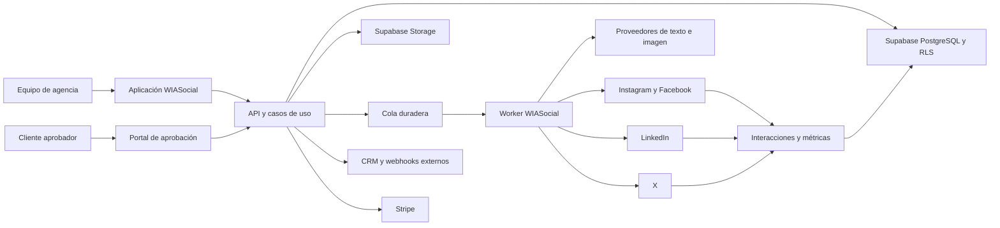
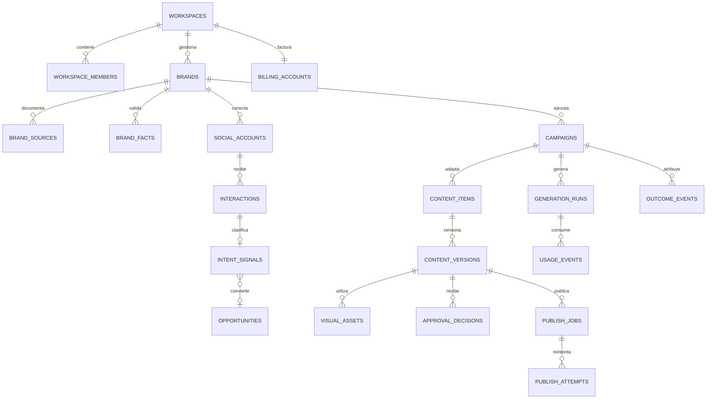
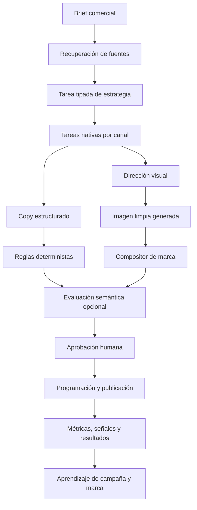

# Arquitectura Y Roadmap De WIASocial

**Estado:** decisión de producto y arquitectura vigente  
**Fecha:** 28 de julio de 2026  
**Horizonte:** estabilización, MVP vendible y evolución multicanal  
**Documentos relacionados:** [Auditoría técnica](AUDITORIA-TECNICA-WIASOCIAL-2026.md) y [arquitectura de IA y orquestación](ARQUITECTURA-IA-Y-ORQUESTACION-WIASOCIAL-2026.md)

## 1. Resumen Ejecutivo

WIASocial no se construirá como un generador de publicaciones sueltas ni como otro calendario con IA. Se construirá como el sistema de campañas y resultados de una agencia pequeña:

> WIASocial convierte un objetivo comercial y el conocimiento real de una marca en una campaña nativa para cada canal, coordina su aprobación, la publica, detecta señales de intención y aprende de los resultados de negocio.

La unidad principal del producto será la **campaña**, no el `post`. Una campaña contiene un objetivo, una audiencia, una oferta, fuentes verificables, un concepto creativo, variantes por canal, versiones, aprobaciones, publicaciones, interacciones y resultados.

La primera arquitectura será un **monolito modular** sobre el stack existente. No se propone una reescritura ni una red de microservicios. Next.js seguirá sirviendo la aplicación y la API; Supabase seguirá proporcionando identidad, PostgreSQL y almacenamiento; los trabajos lentos se sacarán de las peticiones síncronas mediante una cola duradera y un proceso `worker`.

## 2. Decisiones Cerradas

| Decisión | Elección |
|---|---|
| Cliente inicial | Agencia española de 2 a 15 personas que gestiona entre 5 y 25 marcas |
| Problema principal | Transformar objetivos comerciales en campañas aprobadas y demostrar qué señales u oportunidades producen |
| Canales iniciales | Instagram y Facebook como integración directa; LinkedIn y X mediante variantes y exportación |
| Unidad de trabajo | Campaña multicanal |
| Arquitectura | Monolito modular con procesos web y `worker` |
| Tenencia | `workspace` como frontera obligatoria; una agencia tiene varias marcas y miembros |
| IA | Orquestación especializada con adaptadores de proveedor, datos de marca, validadores y revisión humana |
| Imágenes | Imagen limpia generada por IA y composición tipográfica determinista y editable |
| Publicación | Trabajos asíncronos, idempotentes y reintentables |
| Datos de aprendizaje | Versiones aceptadas, cambios solicitados, publicaciones, señales y resultados |
| Estrategia de migración | Sustitución gradual detrás de banderas, sin apagar las funciones existentes |

## 3. Qué Construimos

La navegación objetivo será:

```text
Inicio
Clientes y marcas
Campañas
Calendario
Aprobaciones
Señales
Informes
Configuración
```

### 3.1. Inicio

Panel operativo de la agencia:

- campañas bloqueadas o pendientes de aprobación;
- publicaciones programadas y fallidas;
- señales con intención comercial;
- consumo de IA y coste estimado;
- estado de conexiones sociales;
- resultados recientes por marca.

### 3.2. Clientes Y Marcas

Cada marca tendrá:

- identidad visual y verbal;
- audiencia, oferta y objetivos;
- productos, servicios, precios y condiciones;
- pruebas, casos, testimonios y fuentes;
- afirmaciones permitidas y prohibidas;
- preguntas frecuentes y objeciones;
- cuentas sociales conectadas;
- historial de aprobaciones, correcciones y resultados.

La memoria no será un único bloque de texto. Cada dato importante tendrá fuente, estado de validación, fecha y alcance.

### 3.3. Campañas

El usuario define:

- objetivo comercial;
- producto u oferta;
- audiencia;
- resultado esperado;
- canales candidatos;
- fecha, restricciones y llamada a la acción;
- fuentes que la IA puede utilizar.

WIASocial propone un concepto común y genera variantes realmente nativas:

| Canal | Papel principal | Formatos iniciales |
|---|---|---|
| Instagram | Deseo visual, descubrimiento, guardados, mensajes y reservas | carrusel, publicación, guion de Reel, Stories |
| Facebook | Contexto local, comunidad, eventos, enlaces y conversación | publicación, imagen, evento, adaptación de Reel |
| LinkedIn | Autoridad, casos, opinión experta y demanda B2B | texto, documento, artículo breve, publicación de fundador |
| X | Opinión, actualidad, conversación y distribución de ideas | publicación, hilo y respuestas sugeridas |

No se obligará a utilizar todos los canales. El sistema recomendará el conjunto adecuado según marca, objetivo y evidencia disponible.

### 3.4. Aprobaciones

Un enlace de revisión permitirá al cliente:

- aprobar una campaña completa o una pieza concreta;
- solicitar cambios sobre una versión;
- comentar en contexto;
- comparar versiones;
- comprobar formato, texto, imagen y llamada a la acción;
- registrar quién decidió y cuándo.

### 3.5. Señales

Comentarios, mensajes y respuestas se clasificarán como:

- oportunidad;
- pregunta;
- objeción;
- reserva o solicitud de cita;
- soporte;
- opinión positiva;
- ruido o interacción sin intención.

Cada señal podrá asignarse, convertirse en contacto u oportunidad y vincularse con la campaña de origen.

### 3.6. Informes

El informe principal responderá a cinco preguntas:

1. ¿Qué quería conseguir la campaña?
2. ¿Qué se produjo y publicó en cada canal?
3. ¿Qué alcance, interacción y señales obtuvo?
4. ¿Qué oportunidades o resultados se pudieron identificar?
5. ¿Qué debe repetirse, corregirse o detenerse?

## 4. Qué No Construimos Ahora

- Un clon completo de Hootsuite, Metricool o Sprout Social.
- Escucha global ilimitada de todas las redes.
- Un CRM generalista que sustituya a HubSpot o HighLevel.
- Automatización masiva de mensajes o interacción falsa.
- Publicación en perfiles personales donde la API no lo permita.
- Entrenamiento de un modelo fundacional propio.
- Microservicios independientes antes de necesitar escalado organizativo real.
- Edición profesional de vídeo en la primera versión.

## 5. Principios De Arquitectura

1. **Preservar antes de sustituir.** Las funciones existentes permanecen activas hasta que su reemplazo tenga datos migrados, pruebas y ventana de reversión.
2. **Una campaña, varias expresiones.** Los canales comparten estrategia, no el mismo texto recortado.
3. **Datos antes que prompts.** La calidad nace de fuentes, memoria estructurada, contratos y evaluación.
4. **Operaciones lentas fuera de HTTP.** Generación, publicación, sincronización e informes serán trabajos duraderos.
5. **Idempotencia por defecto.** Repetir una petición no debe duplicar publicaciones, cargos ni datos.
6. **Revisión humana explícita.** La IA no publica contenido comercial sin aprobación durante las primeras fases.
7. **Coste observable.** Cada generación registra proveedor, modelo, consumo, latencia, coste, resultado y campaña.
8. **Seguridad por frontera.** `workspace_id`, RLS, credenciales privadas y autorización del servidor en cada operación.
9. **Interfaces finas.** Las páginas y rutas coordinan; los módulos de aplicación contienen los casos de uso.
10. **Evolución medible.** Cada fase tiene criterios de salida técnicos y comerciales.

## 6. Vista General Del Sistema



### 6.1. Contenedores Iniciales

| Contenedor | Responsabilidad | Despliegue inicial |
|---|---|---|
| `web` | Next.js, interfaz, portal de aprobación y API | Railway |
| `worker` | Generación, composición, publicación, sincronización y reintentos | Railway, mismo repositorio |
| PostgreSQL | Fuente de verdad, RLS, outbox y estado de trabajos | Supabase |
| Storage | Originales, imágenes generadas, composiciones y exportaciones | Supabase |
| Proveedores externos | IA, redes sociales, facturación y CRM | Adaptadores |

No se separarán servicios por módulo. `web` y `worker` compartirán contratos y módulos de dominio.

## 7. Estructura Objetivo Del Repositorio

La migración será gradual hacia esta estructura:

```text
src/
  app/                         # páginas, layouts y route handlers finos
  features/
    workspaces/
      domain/
      application/
      infrastructure/
      ui/
    brands/
    campaigns/
    content/
    approvals/
    publishing/
    signals/
    reporting/
    billing/
  platform/
    auth/
    database/
    jobs/
    ai/
    social/
    storage/
    observability/
    security/
  components/ui/              # componentes visuales sin lógica de negocio
  contracts/                  # esquemas compartidos y eventos
worker/
  index.ts
  handlers/
supabase/
  migrations/                 # migraciones con sello temporal
tests/
  unit/
  integration/
  contract/
  e2e/
```

No se moverán todos los archivos en una sola operación. Cada módulo se trasladará cuando se modifique por una fase del roadmap.

## 8. Límites De Módulo

| Módulo | Es propietario de | No debe hacer directamente |
|---|---|---|
| Workspaces | miembros, roles, invitaciones y límites | generar contenido o llamar redes |
| Brands | perfil, fuentes, hechos y reglas de marca | publicar |
| Campaigns | objetivo, brief, canales y estado global | conocer SDK concretos de IA |
| Content | piezas, versiones, texto, diseño y calidad | gestionar credenciales sociales |
| Approvals | solicitudes, comentarios y decisiones | editar versiones aprobadas |
| Publishing | programación, trabajos, intentos e identificadores remotos | decidir estrategia creativa |
| Signals | interacciones, clasificación y asignación | facturar |
| Reporting | agregaciones, atribución y aprendizajes | modificar contenido histórico |
| Billing | plan, derechos, créditos, coste y conciliación | controlar la interfaz directamente |
| Platform | adaptadores técnicos compartidos | contener reglas específicas de campaña |

La comunicación entre módulos se hará mediante casos de uso y eventos, no mediante consultas arbitrarias desde cualquier componente.

## 9. Modelo De Datos Objetivo



### 9.1. Reglas De Datos

- Toda entidad operativa incluye `workspace_id`.
- Toda entidad de cliente incluye además `brand_id`.
- Las versiones de contenido aprobadas son inmutables.
- Las credenciales no se almacenan en tablas seleccionables desde el navegador.
- Los hechos de marca guardan `source_id`, nivel de confianza, estado y fecha de revisión.
- Las publicaciones remotas guardan identificador del proveedor e `idempotency_key`.
- Los importes se almacenan como enteros en la unidad mínima o `numeric`, nunca como coma flotante.
- Todos los eventos relevantes incluyen `created_at`, actor y correlación.

### 9.2. Estados Principales

```text
campaign:
draft -> generating -> in_review -> approved -> scheduled -> active -> completed -> archived

content_item:
draft -> in_review -> changes_requested -> approved -> scheduled -> published
                                                    -> failed

publish_job:
queued -> processing -> published
                    -> retry_scheduled -> processing
                    -> failed
                    -> cancelled
```

Las transiciones se validarán en el dominio. No se permitirá editar directamente una pieza aprobada; se creará una versión nueva.

## 10. Flujo De Campaign Studio



### 10.1. Contrato Del Brief

El brief se almacenará como datos estructurados, no como un texto libre opaco:

- `business_objective`;
- `audience_segment`;
- `offer_id` o descripción validada;
- `desired_action`;
- `proof_points`;
- `constraints`;
- `channels`;
- `deadline`;
- `source_ids`.

### 10.2. Adaptación Nativa

Cada adaptador de canal recibe la misma estrategia y devuelve su propio contrato. No recibe el texto final de Instagram para recortarlo.

```ts
interface ChannelAdapter {
  channel: "instagram" | "facebook" | "linkedin" | "x";
  plan(input: CampaignStrategy): Promise<ChannelPlan>;
  validate(content: ContentVersion): QualityFinding[];
  export(content: ContentVersion): Promise<ExportArtifact>;
}
```

### 10.3. Imagen Y Composición

La imagen se generará sin titulares, logotipos ni botones incrustados. WIASocial añadirá de forma determinista:

- tipografía;
- jerarquía;
- colores y contraste;
- logotipo;
- márgenes y zonas seguras;
- llamada a la acción;
- numeración y continuidad de carrusel.

El resultado será editable y verificable en móvil. Esto evita delegar precisión tipográfica y consistencia de marca al modelo de imagen.

### 10.4. Quality Gate

El control de calidad tendrá dos capas:

1. Reglas deterministas para límites, dimensiones, contraste, campos obligatorios, enlaces, afirmaciones prohibidas y duplicación.
2. Evaluación semántica separada, cuando demuestre valor, para fidelidad al brief, naturalidad, coherencia, utilidad y adecuación al canal.

Un error factual, legal o de formato bloquea. Una preferencia de estilo avisa. La aprobación humana sigue siendo obligatoria para publicar.

## 11. Arquitectura De IA

### 11.1. Componentes

- `AITaskRegistry`: define tareas, esquemas, prompts versionados en Git y presupuestos.
- `ContextAssembler`: recupera únicamente los hechos y fuentes autorizados para cada tarea.
- `ModelGateway`: ejecuta el alias de capacidad homologado sin filtrar SDKs al dominio.
- `QualityPipeline`: aplica reglas, verificación de claims y evaluación semántica cuando proceda.
- `ImageProvider`: genera o edita activos limpios.
- `CompositionEngine`: produce el arte final.
- `GenerationLedger`: registra consumo, coste, latencia y resultado.

### 11.2. Estrategia De Proveedores

OpenAI puede seguir siendo el proveedor inicial, pero no formará parte del dominio. Cada proveedor implementará un adaptador común. El cambio de modelo no obligará a modificar páginas, campañas ni almacenamiento.

La selección concreta se hará por tarea. Los modelos competirán en laboratorio, pero producción utilizará un proveedor principal por capacidad y solo fallbacks comparables que hayan superado la misma evaluación. GPT Image, Gemini y Recraft formarán el primer benchmark visual. Los criterios, fallbacks y protocolo de evaluación están definidos en [Arquitectura de IA y orquestación](ARQUITECTURA-IA-Y-ORQUESTACION-WIASOCIAL-2026.md).

No se entrenará una IA propia durante el MVP. El valor se obtiene antes con:

- memoria verificable de marca;
- recuperación de fuentes;
- contratos estructurados;
- reglas por canal;
- evaluación separada;
- datos de aceptación y resultados.

Solo se estudiará ajuste fino cuando exista un conjunto suficiente de ejemplos aceptados y rechazados con una mejora medible frente al sistema de recuperación.

### 11.3. Registro De Generación

Cada ejecución debe guardar:

- `workspace_id`, `brand_id`, `campaign_id` y actor;
- tarea y versión del prompt;
- proveedor, modelo y parámetros;
- identificadores de las fuentes utilizadas;
- entrada resumida o cifrada según sensibilidad;
- salida estructurada;
- tokens, imágenes, latencia y coste estimado;
- estado, error normalizado y número de intento;
- evaluación y decisión humana posterior.

## 12. Publicación E Integraciones Sociales

### 12.1. Contrato Común

```ts
interface SocialPublisher {
  validate(account: SocialAccount, content: ContentVersion): Promise<ValidationResult>;
  publish(command: PublishCommand): Promise<RemotePublication>;
  refreshMetrics(publicationId: string): Promise<PublicationMetrics>;
  refreshConnection(accountId: string): Promise<ConnectionHealth>;
}
```

Cada red conserva sus propios formatos, permisos, errores y límites. El contrato común no debe ocultar capacidades específicas.

### 12.2. Orden De Canales

1. Instagram y Facebook mediante una capa Meta compartida, con adaptadores separados.
2. LinkedIn con exportación primero y publicación directa cuando la aplicación obtenga acceso aprobado.
3. X como conexión opcional y con presupuesto por uso.

### 12.3. Cola E Idempotencia

Generación, publicación, sincronización e informes se procesarán como trabajos duraderos:

- `idempotency_key` única por operación lógica;
- entrega al menos una vez;
- reintentos con espera creciente y variación aleatoria;
- clasificación de errores permanentes y temporales;
- bandeja de trabajos fallidos;
- cancelación antes de publicar;
- registro de cada intento;
- patrón `outbox` para no perder eventos entre PostgreSQL y el `worker`.

La tecnología concreta de ejecución se encerrará detrás de `JobRunner`. Trigger.dev Cloud es la recomendación provisional para los trabajos largos por su encaje con TypeScript, concurrencia, reintentos e idempotencia. El estado canónico y las esperas de aprobación seguirán en PostgreSQL; cada aprobación iniciará un trabajo nuevo y el patrón `outbox` será propio.

n8n no será la cola ni el motor de Campaign Studio. Se podrá usar como capa opcional de integraciones externas mediante la API y eventos firmados de WIASocial, sujeto a confirmar la licencia necesaria cuando aloje flujos o credenciales de clientes.

## 13. Seguridad Y Privacidad

### 13.1. Autorización

- La pertenencia al `workspace` se comprueba en el servidor y mediante RLS.
- Roles iniciales: `owner`, `admin`, `editor`, `analyst` y `viewer`.
- Los enlaces de aprobación usan tokens de un solo uso o caducables, con alcance limitado.
- Las rutas privadas no dependerán solo de una redirección en el navegador.

### 13.2. Secretos

- Tokens sociales en esquema privado, servicio de secretos o cifrado de aplicación.
- Ningún `select` desde el cliente devuelve credenciales.
- Rotación y monitor de caducidad.
- Estado OAuth firmado, comparado en tiempo constante y consumido una sola vez.

### 13.3. Entradas Y Salidas

- Esquemas de validación para cuerpos HTTP, respuestas de IA y eventos externos.
- Límites de tamaño y tiempo.
- Destinos de webhook públicos y validados.
- Errores externos normalizados antes de mostrarlos.
- Sanitización y tratamiento de documentos de marca como datos no confiables.

### 13.4. Auditoría

Se registrarán cambios de rol, conexiones, aprobaciones, publicaciones, exportaciones, cambios de plan y operaciones administrativas. Los registros de auditoría serán inmutables para el usuario normal.

## 14. Observabilidad Y Coste

Cada petición y trabajo tendrá un `correlation_id`. Las métricas mínimas serán:

- latencia y errores por caso de uso;
- profundidad y edad de cola;
- publicación correcta, reintentada y fallida;
- salud y caducidad de cuentas sociales;
- generación por proveedor, modelo y tarea;
- coste de IA por `workspace`, marca y campaña;
- margen estimado por plan;
- eventos Stripe recibidos, procesados y fallidos;
- campañas aprobadas y tiempo hasta aprobación.

Alertas iniciales:

- error 5xx sostenido;
- cola sin avanzar;
- publicación fallida tras agotar reintentos;
- token próximo a caducar;
- coste diario anómalo;
- evento Stripe no conciliado;
- caída de una integración externa.

## 15. Estrategia De Pruebas

| Nivel | Qué protege | Ejemplos |
|---|---|---|
| Unitarias | reglas puras y transiciones | estados, Quality Gate, adaptación de canal, límites |
| Contrato | proveedores e integraciones | respuestas de IA, Meta, LinkedIn, X, Stripe |
| Integración | PostgreSQL, RLS y casos de uso | membresías, aislamiento, idempotencia, migraciones |
| E2E | flujos de negocio | crear campaña, aprobar, exportar, publicar, recuperar fallo |
| Visuales | composición y respuesta | carrusel móvil, formatos por red, textos largos |

La línea mínima de CI será lint, tipos, unitarias, integración acotada, build y smoke. No se fusionará una migración sin aplicar desde cero y probar RLS.

## 16. Migración Sin Perder Funcionalidad

### 16.1. Regla General

Las pantallas actuales se consideran `legacy`, no desechables. El reemplazo de una función seguirá esta secuencia:

1. Crear tablas y casos de uso nuevos.
2. Activar la función para el equipo interno mediante bandera.
3. Copiar datos existentes con un proceso repetible.
4. Comparar resultados y registrar diferencias.
5. Habilitar nuevos pilotos por `workspace`.
6. Mantener reversión durante una ventana acordada.
7. Retirar el camino anterior solo cuando no tenga uso, datos exclusivos ni regresiones.

### 16.2. Correspondencia Inicial

| Modelo actual | Destino |
|---|---|
| usuario | miembro `owner` de un `workspace` inicial |
| `user_settings` | marca predeterminada y preferencias del miembro |
| `clients` | marcas del `workspace` |
| `instagram_connections` | `social_accounts` más credencial privada |
| `generated_content` | documentos y versiones de contenido importadas |
| `calendar_items` | programación vinculada a contenido |
| `leads` | contactos, señales u oportunidades según su estado |
| `post_performance` | publicaciones remotas y métricas importadas |

La migración no inventará relaciones que no existan. Los registros ambiguos se marcarán como importados y requerirán revisión.

## 17. Roadmap

Las duraciones son rangos orientativos para un equipo de dos desarrolladores con apoyo de diseño y producto. Con una sola persona deben tratarse como esfuerzo, no como calendario comprometido.

### Fase 0. Estabilización Y Limpieza

**Duración estimada restante:** 1 a 2 semanas.  
**Objetivo:** poder construir y desplegar con confianza sin retirar funciones.

Incluido en la rama actual:

- lint sin residuos conocidos;
- Stripe inicializado de forma perezosa;
- errores de persistencia de Stripe propagados;
- webhook saliente protegido frente a destinos privados, redirecciones y esperas indefinidas;
- contexto completo enviado a informes y detector de tendencias;
- migración para objetos que el código ya utiliza;
- comando único `migrate:all`;
- dependencias parcheadas dentro de Next.js 15;
- 17 pruebas unitarias para reglas de seguridad, marca y contenido;
- CI básica de lint, tipos, pruebas y build;
- README e índice documental actualizados.

Pendiente para cerrar la fase:

- obtener y comparar el esquema real de producción;
- aplicar la migración completa en una base nueva y después en staging;
- ampliar pruebas de integración RLS y smoke E2E;
- resolver las alertas residuales de `postcss` y `sharp` mediante una actualización de Next.js probada, no con una bajada automática insegura;
- cifrar o aislar los tokens de Instagram;
- añadir validación estructurada a las rutas críticas;
- corregir todas las escrituras que todavía ignoran errores;
- implantar idempotencia mínima en Stripe e Instagram.

**Criterio de salida:** build, lint, tipos, pruebas y smoke en verde; esquema reproducible; ningún P0 abierto; rollback documentado.

### Fase 1. Núcleo Multiempresa

**Duración:** 3 a 4 semanas.  
**Objetivo:** representar correctamente agencia, miembros, marcas y conexiones.

Entregables:

- `workspaces`, membresías, roles e invitaciones;
- `brands` y selector activo de marca;
- cuentas sociales desacopladas del usuario;
- almacenamiento privado de credenciales;
- límites y consumo por `workspace`;
- migración de usuarios y clientes actuales;
- navegación base nueva detrás de una bandera.

**Criterio de salida:** una agencia puede invitar a un editor, gestionar al menos cinco marcas y no acceder a datos de otro `workspace` en pruebas RLS.

### Fase 2. Campaign Studio Vertical

**Duración:** 4 a 6 semanas.  
**Objetivo:** convertir un brief real en una campaña multicanal revisable.

Entregables:

- brief comercial estructurado;
- fuentes y hechos verificables de marca;
- estrategia común de campaña;
- variantes nativas para Instagram, Facebook, LinkedIn y X;
- versiones inmutables;
- adaptadores de proveedor de texto e imagen;
- imagen limpia y composición final;
- Quality Gate determinista y evaluación semántica cuando aporte una mejora medida;
- registro de coste y latencia.

**Criterio de salida:** al menos el 70 % de propuestas de piloto se acepta con cambios menores y menos del 5 % contiene errores factuales o de marca.

### Fase 3. Aprobaciones Y Exportación

**Duración:** 2 a 3 semanas.  
**Objetivo:** vender el flujo completo aunque no todas las APIs estén conectadas.

Entregables:

- portal de cliente sin cuenta completa;
- comentarios, aprobación y solicitud de cambios;
- comparación de versiones;
- exportación por canal con dimensiones y textos correctos;
- calendario de campaña;
- historial y auditoría.

**Criterio de salida:** una agencia completa brief, generación, revisión, aprobación y entrega sin usar documentos o mensajería externos.

**Hito comercial:** MVP vendible para pilotos de pago.

### Fase 4. Operación Meta

**Duración:** 4 a 5 semanas.  
**Objetivo:** publicar y medir Instagram y Facebook de forma fiable.

Entregables:

- conexión de varias cuentas por `workspace`;
- adaptadores independientes para Instagram y Facebook;
- cola de publicación, idempotencia y reintentos;
- programación, cancelación y recuperación manual;
- sincronización incremental de métricas;
- monitor de permisos y caducidad;
- panel de operaciones fallidas.

**Criterio de salida:** más del 99 % de trabajos válidos se publica o queda en un estado recuperable y explicable, sin duplicados.

**Hito comercial:** beta de agencia con publicación directa Meta.

### Fase 5. Señales Y Resultados

**Duración:** 4 a 6 semanas.  
**Objetivo:** demostrar valor más allá de alcance e interacción.

Entregables:

- entrada de comentarios y mensajes permitidos;
- clasificación de intención con revisión;
- asignación y seguimiento;
- contactos y oportunidades ligeras;
- enlaces y parámetros UTM;
- webhooks y sincronización con CRM;
- atribución con niveles de confianza;
- informe de campaña y aprendizaje.

**Criterio de salida:** cada campaña puede enseñar contenido, señales, oportunidades identificadas y coste de producción en una misma vista.

**Hito comercial:** propuesta diferencial completa.

### Fase 6. LinkedIn Y X Directos

**Duración:** 5 a 7 semanas, condicionada por accesos de plataforma.  
**Objetivo:** pasar de exportación a operación directa donde las APIs lo permitan.

Entregables:

- proceso y evidencias para revisión de LinkedIn;
- publicación y métricas de páginas autorizadas;
- documentos y formatos compatibles;
- conexión X con presupuesto de uso;
- publicaciones, hilos y métricas propias;
- límites y capacidades visibles por red;
- fallback de exportación cuando una capacidad no esté disponible.

**Criterio de salida:** ninguna promesa de interfaz excede los permisos reales de la cuenta conectada.

### Fase 7. Escala Y Expansión

**Inicio:** después de validar retención y margen.  

Posibles líneas:

- TikTok;
- Google Business Profile y reseñas;
- playbooks verticales;
- marca blanca;
- API pública;
- internacionalización;
- comparación de campañas y benchmarks agregados con privacidad;
- ajuste fino de modelos si el conjunto de datos lo justifica.

## 18. Secuencia De Entregas

```text
0. Base fiable
   -> 1. Workspaces y marcas
      -> 2. Campaign Studio
         -> 3. Aprobación y exportación
            -> 4. Meta directo
               -> 5. Señales y resultados
                  -> 6. LinkedIn y X directos
                     -> 7. Expansión
```

No se iniciará una integración social nueva si el modelo de `workspace`, las credenciales privadas y la cola no están resueltos.

## 19. Plan De Los Próximos 30 Días

### Semana 1

- cerrar limpieza y revisión del diff;
- levantar una base Supabase limpia;
- ejecutar `migrate:all`;
- comparar con producción;
- crear pruebas de seguridad, IA, Stripe y RLS;
- decidir la actualización segura de Next.js.

### Semana 2

- diseñar migraciones timestamped del núcleo;
- implementar `workspaces`, membresías y roles;
- crear autorización compartida del servidor;
- generar tipos de base de datos;
- introducir banderas de producto.

### Semana 3

- implementar marcas y selector;
- mover credenciales de Instagram fuera de tablas públicas;
- migrar el usuario actual a `workspace` y marca predeterminada;
- probar aislamiento entre dos organizaciones.

### Semana 4

- implementar esqueleto de campañas y brief;
- crear contratos de eventos y trabajos;
- hacer un primer recorrido interno sin IA: crear campaña, añadir una pieza, versionar y aprobar;
- revisar el resultado con dos agencias piloto.

## 20. Validación De Producto Paralela

La arquitectura no sustituye la validación. Durante las fases 0 a 3 se deben ejecutar:

- 15 entrevistas con agencias;
- observación de 5 procesos reales completos;
- 3 pilotos de pago;
- 2 campañas por marca y al menos 2 marcas por agencia;
- medición de tiempo hasta aprobación, cambios, errores y continuidad de uso.

Objetivos iniciales:

| Métrica | Umbral |
|---|---:|
| Reducción del tiempo hasta campaña aprobada | 30 % o más |
| Propuestas aceptadas con cambios menores | 70 % o más |
| Errores factuales o de marca | menos del 5 % |
| Campañas con variantes realmente distintas por canal | 90 % o más |
| Agencias activas cada semana | 70 % o más |
| Pilotos que continuarían pagando | 60 % o más |

Si menos de dos agencias aceptan pagar por el flujo, se revisará el problema y el segmento antes de ampliar integraciones.

## 21. Riesgos Y Respuestas

| Riesgo | Respuesta |
|---|---|
| Intentar construir todas las redes a la vez | Meta directo primero; LinkedIn y X con exportación |
| Contenido genérico | fuentes, hechos, contratos nativos, evaluación y aprendizaje humano |
| Mala calidad visual | imagen limpia más compositor determinista y revisión móvil |
| APIs lentas o restringidas | adaptadores, capacidades explícitas y fallback de exportación |
| Coste de IA sin control | ledger por ejecución, presupuesto, créditos y alertas |
| Reescritura interminable | migración por módulo y bandera, conservando el camino actual |
| Fuga entre clientes | `workspace_id`, RLS, pruebas de aislamiento y servidor como frontera |
| Publicaciones duplicadas | idempotencia, outbox, intentos y conciliación |
| Métricas sin relación comercial | señales, oportunidades, UTM y atribución con confianza |
| Exceso de alcance | criterios de salida y prohibición de empezar fase sin cerrar dependencias |

## 22. Definición De Terminado

Una función no está terminada solo porque aparece en la interfaz. Debe cumplir:

- caso de uso y permisos definidos;
- entrada y salida validadas;
- estados de carga, vacío, error y recuperación;
- persistencia y migración reproducibles;
- aislamiento RLS probado;
- idempotencia cuando existe efecto externo;
- trazas, coste y errores observables;
- pruebas proporcionales al riesgo;
- documentación operativa;
- reversión o recuperación;
- métrica de producto asociada.

## 23. Resultado Esperado

Al completar las fases 0 a 5, WIASocial será:

> La plataforma donde una agencia convierte lo que un cliente quiere vender en una campaña adaptada a cada red, consigue su aprobación, la publica y demuestra qué oportunidades ha generado.

Esa es la ventaja que debe guiar arquitectura, interfaz, IA, integraciones y modelo comercial. Todo lo que no acerque el producto a ese recorrido debe justificarse antes de entrar en el roadmap.
