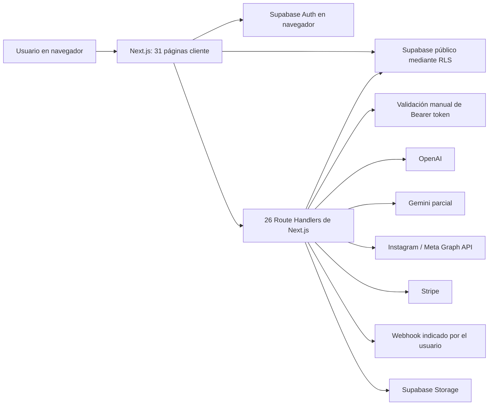
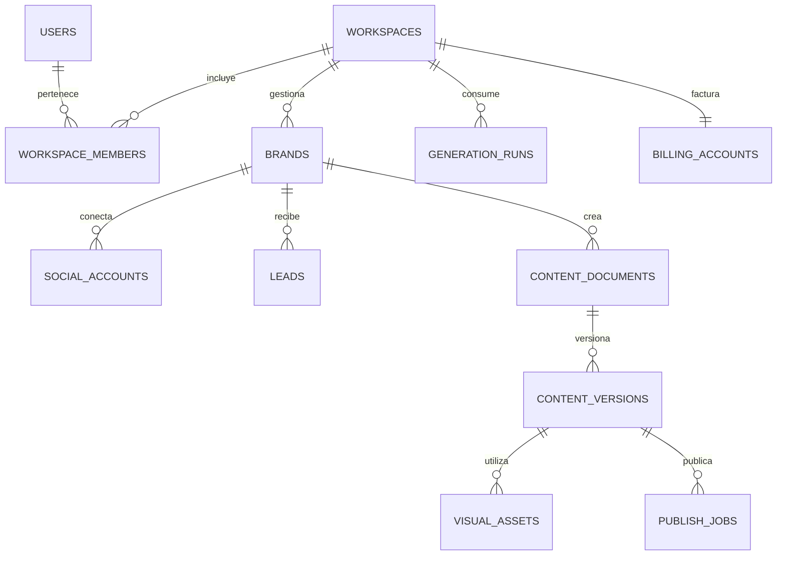
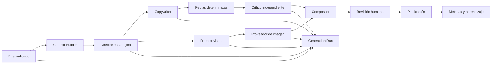
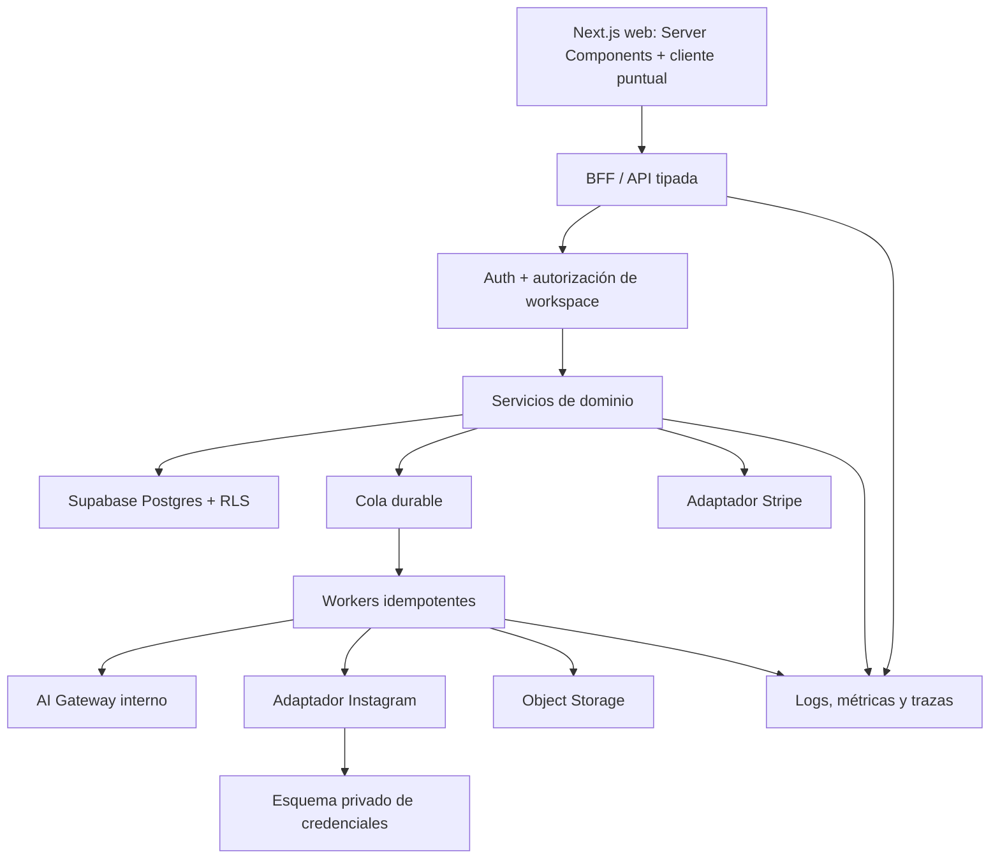

# Auditoría técnica de WIASocial

**Fecha:** 28 de julio de 2026  
**Repositorio analizado:** `GLOBALTECH/WIASocial`  
**Rama:** `codex/specialized-content-engine`  
**Commit base:** `1062c17`  
**Alcance:** arquitectura, frontend, API, datos, autenticación, seguridad, IA, Instagram, Stripe, despliegue, calidad y operación.

## 1. Resumen ejecutivo

WIASocial ya no es una maqueta. El repositorio contiene un SaaS funcional de tamaño medio, con 36 páginas, 26 rutas API, autenticación, persistencia, generación de contenido, conexión con Instagram, publicación de carruseles y una integración de pagos iniciada.

La amplitud de producto es buena, pero ha crecido más rápido que la arquitectura. El sistema está en una fase de **prototipo avanzado / alfa funcional**, no en una fase preparada para venderse con garantías a agencias y clientes de pago.

La conclusión principal es sencilla:

> No hace falta tirar el proyecto. Hace falta estabilizar su base antes de seguir añadiendo módulos.

### Evaluación actual

| Área | Nota | Diagnóstico |
|---|---:|---|
| Alcance funcional | 8/10 | Hay mucho producto real y una propuesta amplia. |
| Arquitectura de aplicación | 5/10 | Válida para una alfa, demasiado acoplada para crecer. |
| Modelo de datos | 3/10 | El repositorio no reproduce la base que el código necesita. |
| Seguridad | 4/10 | Hay buenas bases, pero existe al menos un riesgo bloqueante de SSRF. |
| Multi-tenancy | 2/10 | El producto se presenta para agencias, pero el dominio sigue centrado en un único usuario. |
| Sistema de IA | 4/10 | Genera, pero no tiene trazabilidad, evaluación ni control económico suficientes. |
| Instagram | 5/10 | La integración es real, aunque síncrona, frágil y limitada a una cuenta por usuario. |
| Facturación | 3/10 | Stripe está iniciado, pero no es todavía una fuente de verdad fiable. |
| Calidad y pruebas | 2/10 | No hay tests ni CI; lint y build no pasan en todas las configuraciones. |
| Observabilidad | 1/10 | No hay trazas, métricas de negocio técnico, alertas ni seguimiento de costes. |
| Preparación para producción | 4/10 | Puede demostrarse, pero no debe escalarse todavía a clientes de pago. |

**Nota técnica global: 4,1/10.**

Esta nota no mide la idea ni el valor comercial. Mide la capacidad del sistema para operar de forma segura, repetible y mantenible con clientes reales.

## 2. Qué está bien resuelto

Antes de entrar en los problemas, hay decisiones aprovechables que deben conservarse:

- TypeScript está en modo estricto.
- Las rutas API verifican mayoritariamente el token de Supabase en el servidor.
- Las tablas registradas habilitan RLS y separan datos por `user_id`.
- El webhook de Stripe comprueba su firma.
- El estado OAuth de Instagram está firmado y caduca.
- Existen cabeceras de seguridad globales.
- Hay limitación de frecuencia compartida mediante PostgreSQL, con una alternativa local.
- El contexto de IA ya incorpora marca, leads, publicaciones e información de Instagram.
- El Content Studio tiene contrato estructurado, router de plantillas, exportación PNG y revisión visual.
- La publicación usa URLs firmadas temporales en vez de hacer público el bucket.
- Las integraciones externas están separadas en librerías razonablemente identificables.
- Hay páginas de error, privacidad, términos y recuperación de contraseña.

La estrategia técnica debe reforzar estas bases, no sustituirlas sin necesidad.

## 3. Fotografía del sistema actual

### Inventario

- 124 archivos TypeScript/TSX.
- 19.085 líneas aproximadas en `src`.
- 36 páginas, de las cuales 31 son componentes cliente completos.
- 26 rutas API.
- 11 archivos SQL.
- 0 tests automatizados.
- 0 workflows de integración continua.
- 17 archivos de más de 300 líneas.
- 3 archivos de más de 500 líneas.
- Archivo principal del Content Studio: 1.683 líneas.
- Librería de acceso a datos del navegador: 628 líneas.
- Ruta API general de IA: 433 líneas.

### Tecnologías

- Next.js 15.5.19 y App Router.
- React 19.
- TypeScript 5.9.
- Tailwind CSS 4.
- Supabase Auth, PostgreSQL, RLS y Storage.
- OpenAI como proveedor principal de texto.
- Gemini como alternativa parcial para Content Studio.
- Meta/Instagram Graph API.
- Stripe para suscripciones.
- Railway con Nixpacks, Node.js 22 y `npm ci`.

### Arquitectura real



No existe una capa explícita de dominio, una cola de trabajos, un registro de generaciones, un sistema de eventos ni una frontera multi-tenant.

## 4. Hallazgos priorizados

### P0: bloqueantes antes de cobrar a clientes

| Hallazgo | Impacto |
|---|---|
| El endpoint de webhooks puede solicitar cualquier URL | SSRF, acceso a redes privadas y agotamiento de procesos. |
| El esquema SQL versionado no contiene cinco tablas, varias columnas y una RPC que usa el código | Una instalación nueva no reproduce el producto y determinadas funciones fallan o fallan abiertas. |
| El build falla cuando Stripe no está configurado | Una integración opcional rompe el despliegue completo. |
| Los eventos de Stripe ignoran errores de base de datos y aun así devuelven `200` | Stripe no reintenta y el plan local puede quedar desincronizado. |
| El control gratuito de IA depende de una tabla y una RPC inexistentes en las migraciones | En una instalación limpia puede quedar uso gratuito ilimitado sin detectarlo. |
| Dependencias de producción con tres alertas de severidad alta | Riesgos conocidos en Next.js, PostCSS y Sharp. |

### P1: necesarios para una beta seria

| Hallazgo | Impacto |
|---|---|
| No existe un modelo real de espacios, miembros, marcas y cuentas | No se puede ofrecer un producto multi-cliente de agencia de forma coherente. |
| Una conexión de Instagram por usuario | Contradice el plan Agency y bloquea varias marcas. |
| Tokens de Instagram en texto claro y seleccionables por el propietario vía API pública | Aumenta mucho el impacto de XSS, extensiones maliciosas o una sesión comprometida. |
| No hay tests ni CI | Cada cambio puede romper autenticación, facturación, RLS o publicación sin aviso. |
| Dos rutas envían `"[object Object]"` en vez del contexto a OpenAI | Informes mensuales y tendencias no usan realmente los datos prometidos. |
| No hay validación de entrada ni salida con esquemas | Peticiones enormes, JSON inesperado y fallos de interfaz o persistencia. |
| Instagram se sincroniza de forma síncrona y con cientos de peticiones potenciales | Timeouts, límites de API y mala experiencia. |
| No existe renovación automática del token de Instagram | Las conexiones caducan sin recuperación operativa. |
| No hay trazabilidad de generaciones, tokens, latencia ni coste | No se puede controlar margen, calidad ni incidencias de IA. |
| Los planes de pago no registran uso de IA porque su límite es `Infinity` | Se pierde por completo el control económico de los clientes que más consumen. |
| El Content Studio mezcla interfaz, normalización, canvas, exportación y publicación | Riesgo alto de regresiones y dificultad para probarlo. |
| Protección de páginas privadas solo en el navegador | Carga innecesaria, peores transiciones y una frontera de autenticación débil. |

### P2: mejora y escalabilidad

- CSP permite `unsafe-inline` y `unsafe-eval`.
- El estado OAuth no es de un solo uso y compara firmas sin `timingSafeEqual`.
- El endpoint de salud publica qué integraciones están configuradas.
- No hay límites de tamaño explícitos para cuerpos JSON y base64.
- No hay timeouts comunes para proveedores externos.
- Los errores de proveedores se devuelven a menudo casi directamente al cliente.
- Varias escrituras de base de datos no comprueban el error.
- Hay operaciones de borrar e insertar que no son transaccionales.
- No se limpian los recursos temporales usados para publicar en Instagram.
- No hay idempotencia en publicación, sincronización ni eventos de Stripe.
- No hay una política consistente de fechas y zona horaria por usuario.
- README y `.env.example` no describen todo lo necesario para operar el producto.

## 5. Base de datos y reproducibilidad

### Deriva de esquema

El código utiliza estas tablas que no aparecen en ningún SQL versionado:

- `ai_usage`
- `clients`
- `growth_radar_cache`
- `monthly_reports`
- `trend_detector_cache`

También utiliza columnas ausentes del esquema registrado:

- `user_settings.plan`
- `user_settings.stripe_customer_id`
- `user_settings.stripe_subscription_id`
- `user_settings.plan_expires_at`
- `user_settings.webhook_url`
- `leads.deal_value`

Y llama a una función que tampoco está definida:

- `increment_ai_usage`

Es posible que parte de estos objetos exista en la base desplegada por cambios manuales. Eso no resuelve el problema: implica que producción y Git no tienen una fuente de verdad común.

### Sistema de migraciones

Los SQL actuales son archivos independientes sin sello temporal ni historial aplicado. Los scripts ejecutan subconjuntos concretos, pero no existe un comando único que construya una base nueva de principio a fin.

Riesgos:

- No se sabe con certeza qué versión de esquema tiene cada entorno.
- Una migración puede aplicarse dos veces o en distinto orden.
- No hay rollback documentado.
- No hay validación automática de RLS, índices, funciones o columnas.
- El build no detecta la diferencia entre tipos TypeScript y PostgreSQL.

### Tipado

No se generan tipos de Supabase a partir del esquema. El código usa conversiones manuales como `as string`, `as number` y estructuras `Record<string, unknown>`. Por eso TypeScript puede pasar aunque la tabla o columna ni siquiera exista.

### Escrituras no atómicas

Ejemplos relevantes:

- Crear un lead y su seguimiento son dos escrituras; el error de la segunda se ignora.
- Guardar calendario borra primero todos los elementos planificados y luego inserta. Si la inserción falla, el calendario anterior se pierde.
- Las tareas de engagement siguen el mismo patrón de borrar e insertar.
- La sincronización de Instagram actualiza varias tablas sin transacción ni estado de ejecución.
- Faltan restricciones únicas como `(user_id, recorded_at)` en snapshots de seguidores.

### Decisión recomendada

1. Obtener un volcado del esquema real de producción.
2. Compararlo con el repositorio y decidir qué objetos son válidos.
3. Crear un baseline versionado con Supabase CLI.
4. Convertir todos los cambios posteriores en migraciones timestamped.
5. Generar tipos de base de datos en CI.
6. Añadir pruebas RLS para cada entidad.
7. Convertir reemplazos destructivos en funciones SQL transaccionales.

## 6. Seguridad

### 6.1. SSRF en webhooks

`POST /api/webhooks` lee `user_settings.webhook_url` y ejecuta `fetch(webhookUrl)` sin validación de destino.

Un usuario autenticado puede apuntar el servidor a:

- `localhost` y servicios del propio contenedor.
- Rangos privados IPv4 o IPv6.
- Endpoints de metadatos de infraestructura.
- Destinos que nunca responden.
- Redirecciones hacia hosts prohibidos.

La solución debe incluir:

- Solo `https` en producción.
- Resolución DNS y bloqueo de IP privada, loopback, link-local y reservada.
- Nueva validación después de cada redirección o redirecciones desactivadas.
- Timeout con `AbortSignal.timeout`.
- Límite de cuerpo y tamaño de respuesta.
- Firma HMAC del webhook y secreto rotatorio.
- Registro de intento, resultado y latencia.
- Entrega asíncrona con reintentos, no dentro de la petición del usuario.

### 6.2. Credenciales de Instagram

`instagram_connections.access_token` está en la misma tabla pública que los metadatos y la política RLS permite seleccionar la fila propia completa.

La RLS evita leer el token de otro usuario, pero no evita que JavaScript ejecutado en la sesión, una extensión o un XSS lea el token del usuario actual.

Arquitectura recomendada:

- Metadatos no sensibles en una tabla pública protegida por RLS.
- Credenciales en un esquema privado no expuesto por PostgREST.
- Cifrado de aplicación o servicio de secretos para el token.
- Acceso solo desde funciones servidoras.
- Rotación y revocación al desconectar.
- No registrar nunca URLs que incluyan `access_token`.

### 6.3. Validación y límites

Las rutas API tipan el cuerpo con TypeScript, pero TypeScript no valida datos en ejecución. No se utiliza Zod, JSON Schema ni una alternativa equivalente.

Debe existir un contrato por endpoint para:

- Acción permitida.
- Longitud de cada texto.
- Número de elementos.
- Formato de URL.
- Tamaño total de petición.
- MIME y bytes reales de imágenes.
- Enumeraciones de plan, formato, idioma y estado.
- Salida de cada proveedor de IA.

La publicación de Instagram admite base64 y limita el número de slides después de parsear el JSON, pero no limita el tamaño total recibido. Eso permite consumir una cantidad excesiva de memoria antes de llegar al límite del bucket.

### 6.4. Autenticación de páginas

Las APIs verifican el token correctamente en la mayoría de casos. Sin embargo, las páginas privadas se generan como contenido estático y `AuthGuard` decide en el navegador si mostrar o redirigir.

No se ha encontrado una exposición directa de datos por este motivo, porque los datos se obtienen después mediante RLS o APIs autenticadas. Aun así, la arquitectura recomendada es:

- Sesión compatible con servidor mediante `@supabase/ssr`.
- Protección de rutas en middleware/proxy y layouts de servidor.
- Cliente solo para interacciones que lo necesiten.
- Autorización por workspace en cada operación, no solo autenticación.

### 6.5. OAuth y CSP

El estado OAuth firmado y con caducidad es una buena base. Debe endurecerse con nonce de un solo uso y comparación constante de firmas.

La CSP actual pierde gran parte de su valor por permitir `unsafe-inline` y `unsafe-eval`. El callback OAuth usa un script inline, pero puede servirse con nonce o como redirección segura sin obligar a debilitar toda la aplicación.

### 6.6. Dependencias

Tras una instalación limpia:

- `npm audit --omit=dev` detecta 3 paquetes de producción con severidad alta.
- La auditoría completa detecta 6 vulnerabilidades altas.
- Los avisos afectan a Next.js, PostCSS, Sharp, `brace-expansion` y `js-yaml`.

No conviene ejecutar una actualización mayor indiscriminada. El orden correcto es:

1. Subir primero a la última versión corregida compatible dentro de Next.js 15.
2. Actualizar las dependencias transitivas corregidas.
3. Ejecutar typecheck, tests, build y smoke tests.
4. Planificar Next.js 16 como migración separada.

## 7. Multi-tenancy y producto para agencias

El sistema actual no es multi-tenant. Es un usuario con datos asociados mediante `user_id`.

La tabla `clients`, si existe en producción, es un CRM ligero. No está relacionada con:

- Contenido generado.
- Instagram.
- Leads.
- Analítica.
- Radar de crecimiento.
- Facturación.
- Calendario.

Además, `instagram_connections.user_id` es único. Un usuario solo puede conectar una cuenta.

Por tanto, la promesa de “CRM multi-cliente ilimitado” no está implementada como capacidad de plataforma.

### Modelo objetivo



Entidades mínimas:

- `workspaces`
- `workspace_members`
- `brands`
- `social_accounts`
- `integration_credentials` en esquema privado
- `content_documents`
- `content_versions`
- `visual_assets`
- `generation_runs`
- `publish_jobs`
- `usage_ledger`
- `billing_accounts`
- `billing_events`
- `audit_log`

Todas las entidades operativas deben incluir `workspace_id`; las específicas de una marca también `brand_id`. Las políticas RLS deben comprobar membresía y rol.

Roles iniciales recomendados:

- `owner`
- `admin`
- `editor`
- `analyst`
- `viewer`

## 8. Sistema de IA

### Estado real

La ruta general de IA ofrece múltiples acciones y construye contexto útil. OpenAI es el proveedor real por defecto. Gemini solo entra para Content Studio cuando OpenAI no está configurado.

Anthropic y Mistral existen únicamente en el script de comparación, no en el runtime. Varias variables de entorno sugieren un router de modelos que todavía no existe.

### Problemas funcionales

En `monthly-report` y `trend-detector` se interpola un objeto directamente:

```ts
`User context:\n${ctx}`
```

El resultado enviado al modelo es `User context: [object Object]`. Ambas funciones pierden la información de marca, leads, publicaciones e Instagram.

El detector de tendencias tampoco consulta una fuente actual. Pide al modelo temas “de esta semana”, por lo que puede presentar conocimiento genérico o inventado como tendencia actual.

La búsqueda de hashtags solicita cifras de publicaciones y competencia sin datos en vivo. Esas cifras pueden parecer analítica real aunque sean generadas.

### Calidad

La revisión de calidad del Content Studio forma parte de la misma llamada que genera el contenido. El modelo se evalúa a sí mismo dentro de la misma respuesta, por lo que la puntuación no constituye un control independiente.

El bake-off registrado:

- Solo contiene ejecuciones de Gemini.
- Incluye errores 400 y 503.
- No compara de forma completa varios proveedores.
- No calcula una rúbrica objetiva.
- No registra coste normalizado.
- No tiene evaluación ciega humana.

Es una prueba de conectividad y formato, no una decisión de modelo suficientemente sustentada.

### Persistencia y economía

La generación principal se guarda desde el navegador después de recibir la respuesta. Si el usuario cierra la pestaña o falla la escritura, se paga la llamada pero no queda un registro fiable.

No se registran de forma durable:

- Identificador de generación.
- Workspace y marca.
- Prompt y versión del prompt.
- Proveedor y modelo.
- Tokens de entrada y salida.
- Coste estimado.
- Latencia.
- Intentos y errores.
- Resultado estructurado.
- Estado de aprobación.
- Feedback del usuario.
- Versión regenerada.

Los planes `starter` y `agency` devuelven `Infinity` antes de incrementar uso. Esto significa que los clientes de pago, precisamente los de mayor riesgo económico, no dejan huella en el contador.

### Arquitectura de IA objetivo



### Decisiones técnicas recomendadas

- Un adaptador común por proveedor.
- Modelos elegidos por tarea, no una marca de IA para todo.
- Structured Outputs o JSON Schema cuando el proveedor lo permita.
- Validación de salida y reparación controlada.
- Timeout, reintentos con backoff y circuit breaker.
- Prompts versionados en código.
- Datos del usuario marcados como datos no confiables, no como “Trusted context”.
- Registro de uso incluso en planes ilimitados.
- Presupuesto por workspace y alertas de margen.
- Evaluación independiente y regeneración localizada.
- Dataset fijo de casos reales con evaluación humana.

## 9. Instagram

### Limitaciones actuales

- Una cuenta por usuario.
- Graph API fijada en `v21.0` en varios archivos.
- No existe proceso programado de renovación de token.
- No existe monitor de caducidad o conexión degradada.
- Los scopes no incluyen gestión de mensajes.
- Se mantienen dos caminos: Instagram Login y Facebook Login legado.
- La sincronización obtiene hasta 100 publicaciones.
- Cada publicación puede disparar insights y comentarios.
- El enriquecimiento se lanza en paralelo y puede provocar una ráfaga cercana a 200 peticiones.
- Después se realizan varias operaciones de base de datos por publicación.
- Todo ocurre dentro de una única petición HTTP.

### Publicación

La publicación de carrusel tiene buenas ideas, como el bucket privado y la URL firmada. Le faltan garantías operativas:

- Validación de dimensiones y bytes reales.
- Límite de cuerpo antes de decodificar base64.
- Idempotency key.
- Registro de `publish_job`.
- Consulta del estado del contenedor antes de publicar.
- Reintentos seguros.
- Limpieza de assets temporales.
- Registro del error normalizado de Meta.
- Reconciliación posterior con el media ID publicado.

### Propuesta

1. Crear un trabajo de sincronización y devolver `202 Accepted`.
2. Procesar páginas de medios con concurrencia limitada.
3. Guardar cursor, progreso, intento y error.
4. Renovar tokens antes de caducar.
5. Marcar conexiones como `healthy`, `expiring`, `expired` o `revoked`.
6. Separar credenciales de datos públicos.
7. Añadir una conexión por `brand_id`, no por usuario.
8. Implementar publicación como máquina de estados.

## 10. Stripe y planes

### Build

El cliente de Stripe se crea al importar `src/lib/stripe.ts` con una clave forzada mediante `!`. Si la clave no existe, Stripe lanza antes de que `isStripeConfigured()` pueda responder.

Resultado comprobado:

- Build sin `STRIPE_SECRET_KEY`: falla durante `Collecting page data`.
- Build con una clave no vacía simulada: termina correctamente.

Stripe debe inicializarse de forma perezosa dentro del servidor o mediante un getter que valide la configuración al usarlo.

### Webhook

El webhook valida la firma, pero ignora el resultado de los `upsert` y siempre termina con `200`.

Esto puede producir:

- Pago correcto en Stripe y plan gratuito en WIASocial.
- Cancelación en Stripe y acceso que no se retira.
- Eventos fuera de orden que regresan el estado.
- Evento repetido sin registro de idempotencia.
- Plan definido por metadata en vez de por Price ID real.

### Fuente de verdad recomendada

- Tabla `stripe_events` con `event_id` único.
- Guardar evento antes de procesarlo.
- Responder con error si falla una mutación necesaria, para que Stripe reintente.
- Mapear Price ID a plan en el servidor.
- Guardar `customer_id`, `subscription_id`, estado y periodo actual.
- Procesar estados `trialing`, `active`, `past_due`, `unpaid`, `canceled` e `incomplete` según política explícita.
- Reconciliación programada contra Stripe.
- Entitlements separados del nombre comercial del plan.
- Límites de uso configurables, incluso cuando el marketing diga “ilimitado”.

## 11. Frontend y Next.js

### Componentes cliente

31 de 36 páginas son componentes cliente completos. Esto provoca:

- Más JavaScript inicial.
- Cargas de datos después de hidratar.
- Estados de loading repetidos.
- Acceso a base de datos disperso desde el navegador.
- Dificultad para centralizar permisos y errores.
- Menor aprovechamiento de App Router.

El build muestra 102 kB compartidos y la mayoría de pantallas privadas entre 190 y 230 kB de First Load JS. No es un bloqueo inmediato, pero sí una señal clara.

### Content Studio

`content-generator/page.tsx` contiene en un solo archivo:

- Formulario y estado.
- Historial.
- Normalización de respuesta.
- Vista previa.
- Canvas 4:5.
- Layouts de plantillas.
- Ajuste y truncado de texto.
- Descarga PNG.
- Publicación en Instagram.

Debe separarse en módulos probables:

- `ContentStudioPage`
- `useContentGeneration`
- `GenerationForm`
- `GenerationReview`
- `CarouselEditor`
- `carousel-renderer`
- `carousel-layouts`
- `carousel-exporter`
- `instagram-publisher`
- `content-normalizer`

El renderer debe probarse con snapshots visuales y casos extremos de texto.

### Acceso a datos

`src/lib/db.ts` es una capa de repositorio cliente de 628 líneas. Conviene dividirla por dominio y mover las mutaciones sensibles al servidor:

- `leads.repository`
- `content.repository`
- `calendar.repository`
- `analytics.repository`
- `settings.repository`
- `clients.repository`

Las páginas pueden seguir siendo interactivas sin convertir toda la pantalla en cliente.

## 12. Errores, observabilidad y operación

### Estado actual

No se ha encontrado:

- Sentry o alternativa.
- OpenTelemetry.
- Logger estructurado.
- Request ID o trace ID.
- Métricas de latencia.
- Seguimiento de coste IA.
- Alertas de errores de proveedor.
- Cola de trabajos.
- Cron de mantenimiento.
- Panel de salud interno.
- Auditoría de acciones sensibles.

Solo el callback de Instagram registra errores explícitamente. Muchas rutas devuelven errores directamente al cliente y otras ignoran fallos de persistencia.

### Mínimo operativo

- Logger JSON con redacción de secretos.
- `request_id`, `user_id`, `workspace_id` y `operation` en cada evento.
- Sentry para frontend y backend.
- Métricas de tasa de error y p95 por endpoint.
- Métricas por proveedor de IA: latencia, tokens, coste y fallo.
- Métricas de Instagram: sincronizaciones, expiración, rate limit y publicación.
- Métricas de Stripe: evento recibido, procesado, repetido y fallido.
- Alertas por build fallido, error 5xx, cola atascada y margen anómalo.
- Nunca incluir prompts completos, tokens OAuth ni datos personales en logs por defecto.

## 13. Calidad, pruebas y CI

### Comprobaciones ejecutadas

| Comprobación | Resultado |
|---|---|
| `npm ci` | Correcto. |
| `npx tsc --noEmit` tras instalación limpia | Correcto. |
| `npm run lint` | Falla por 7 warnings con máximo 0. |
| `npm run build` sin Stripe | Falla al importar el cliente de Stripe. |
| `npm run build` con variable Stripe simulada | Correcto, con 7 warnings. |
| Tests unitarios | No existen. |
| Tests de integración | No existen. |
| Tests E2E | No existen. |
| CI | No existe. |
| Auditoría de dependencias de producción | Falla con 3 vulnerabilidades altas. |

No se pudo probar el flujo completo autenticado, Instagram ni Stripe contra servicios reales porque el entorno local no tiene configuraciones utilizables de Supabase, Instagram o Stripe. La base desplegada tampoco pudo inspeccionarse desde este checkout.

### Pirámide de pruebas propuesta

#### Unitarias

- Router de plantillas.
- Normalizadores de IA.
- Reglas de calidad.
- Renderer y wrap de texto.
- Cálculos analíticos.
- Mapeo de planes y entitlements.
- Validación de URLs de webhook.
- Máquinas de estado de publicación y sincronización.

#### Integración

- RLS por workspace, marca y rol.
- Migración desde base vacía.
- Uso IA atómico y concurrente.
- Stripe webhook idempotente.
- OAuth state de un solo uso.
- Persistencia de una generación fallida y completada.
- Reintentos de publicación.

#### E2E

- Registro, verificación, login y recuperación.
- Onboarding de marca.
- Generar, editar, guardar y reabrir contenido.
- Exportar carrusel.
- Conectar y desconectar una cuenta simulada de Instagram.
- Checkout y portal con Stripe test mode.
- Cambio entre dos marcas de un workspace.

#### Visuales

- Carruseles con textos cortos, largos y palabras extensas.
- Español e inglés.
- Desktop y móvil.
- Todas las plantillas.
- Comparación por píxeles o snapshots con tolerancia.

### Pipeline mínimo

En cada pull request:

1. `npm ci`
2. Auditoría de secretos.
3. `npm run lint`
4. `npx tsc --noEmit`
5. Tests unitarios.
6. Tests de integración con Supabase local.
7. `npm run build` con configuración mínima.
8. E2E de smoke.
9. Auditoría de dependencias.

## 14. Despliegue y configuración

Railway utiliza Node.js 22 y npm 9. El análisis local se ha ejecutado con Node.js 24 y npm 11. Aunque el build ha compilado, conviene alinear versiones mediante `.nvmrc`, `.node-version` o Volta y usar la misma versión en CI.

`.env.example` no contiene las variables de Stripe que el código necesita:

- `STRIPE_SECRET_KEY`
- `STRIPE_PRICE_STARTER`
- `STRIPE_PRICE_AGENCY`
- `STRIPE_WEBHOOK_SECRET`

También hay variables declaradas que no tienen efecto real en producción, como parte del supuesto router de modelos.

Se necesita un módulo de configuración que:

- Valide variables al arrancar.
- Distinga obligatorias, opcionales y específicas de cada feature.
- No rompa el build por una feature desactivada.
- Exponga un estado interno de feature flags.
- Evite comprobaciones de placeholder repartidas por el código.

## 15. Privacidad y cumplimiento técnico

La política de privacidad enumera Supabase, OpenAI, Stripe y Meta, lo cual es positivo. Aun así, el producto y el documento no están totalmente alineados:

- Se declara recopilación de páginas visitadas, pero no se ha encontrado una plataforma de analítica.
- Se habla de cookies de sesión, mientras la sesión actual de Supabase se gestiona principalmente en el navegador.
- Se promete eliminación de datos al borrar la cuenta, pero no existe flujo de eliminación de cuenta.
- La retención de prompts, respuestas, comentarios de Instagram y assets temporales no está implementada como política técnica.
- No existe exportación de datos ni registro de consentimientos.
- No se ve un proceso para revocar o borrar credenciales al caducar la relación.

Esto no sustituye una revisión legal. Técnicamente se necesita un inventario de datos, finalidad, proveedor, región, retención y método de borrado por cada entidad.

## 16. Arquitectura objetivo



No hace falta convertirlo en microservicios. Un monolito modular de Next.js con PostgreSQL y workers separados es suficiente para esta etapa.

## 17. Roadmap técnico

Estimación orientativa para una persona senior a tiempo completo. Puede comprimirse con dos personas, pero no conviene ejecutar todas las fases en paralelo porque el modelo de datos condiciona el resto.

### Fase 0. Baseline y congelación técnica

**Duración:** 2-3 días.

- Congelar nuevas funcionalidades.
- Copiar y versionar el esquema real de producción.
- Documentar variables y servicios por entorno.
- Alinear Node.js y npm.
- Crear CI inicial.
- Añadir un entorno de staging separado.
- Definir backups y comprobar una restauración.

**Terminado cuando:** se puede construir el mismo commit de forma repetible y se conoce el esquema real.

### Fase 1. Bloqueantes de seguridad y despliegue

**Duración:** 1 semana.

- Cerrar SSRF de webhooks o desactivar temporalmente la feature.
- Hacer Stripe opcional en build.
- Corregir dependencias vulnerables dentro de versiones compatibles.
- Añadir validación de configuración.
- Añadir límites de cuerpo, timeouts y validación de entrada.
- Corregir lint.
- Crear migraciones para todos los objetos ausentes.
- Corregir uso IA fail-open.

**Terminado cuando:** build, lint, typecheck y smoke pasan con configuración mínima y no queda ningún P0 abierto.

### Fase 2. Fundación multi-tenant

**Duración:** 2-3 semanas.

- Crear workspaces, membresías, roles y marcas.
- Migrar datos actuales a un workspace y una marca por usuario.
- Incorporar `workspace_id` y `brand_id` a datos operativos.
- Reescribir RLS y probar aislamiento.
- Permitir varias conexiones sociales por workspace.
- Añadir selector de marca.
- Separar credenciales en almacenamiento privado.

**Terminado cuando:** dos marcas del mismo workspace y dos workspaces distintos quedan completamente aislados.

### Fase 3. Motor de contenido especializado

**Duración:** 2-4 semanas.

- Implementar `generation_runs` y versionado.
- Separar brief, estrategia, copy, visual, composición y crítica.
- Crear adaptadores de proveedor.
- Validar salidas estructuradas.
- Registrar tokens, coste, latencia y errores.
- Añadir Quality Gate independiente.
- Separar Content Studio en módulos probables.
- Añadir pruebas unitarias y visuales.
- Corregir funciones que inventan tendencia o métricas sin fuente.

**Terminado cuando:** toda generación es reproducible, trazable, evaluable y recuperable.

### Fase 4. Instagram durable

**Duración:** 2-3 semanas.

- Convertir sincronización y publicación en trabajos.
- Añadir idempotencia y máquinas de estado.
- Limitar concurrencia y reintentos.
- Renovar tokens y alertar antes de caducar.
- Limpiar assets temporales.
- Añadir reconciliación con Meta.
- Eliminar o aislar el flujo legado si ya no es necesario.

**Terminado cuando:** una caída o timeout no duplica publicaciones ni deja el sistema en un estado desconocido.

### Fase 5. Facturación, observabilidad y operación

**Duración:** 2 semanas.

- Hacer Stripe idempotente y reconciliable.
- Separar planes, precios y entitlements.
- Registrar uso y coste para todos los planes.
- Instalar observabilidad y alertas.
- Crear panel interno de salud y trabajos.
- Añadir auditoría de acciones sensibles.
- Implementar borrado y exportación de datos.

**Terminado cuando:** se puede explicar y reconciliar acceso, coste, factura y fallo de cualquier workspace.

### Fase 6. Beta cerrada

**Duración:** 2-4 semanas.

- Incorporar 5-10 clientes reales controlados.
- Medir calidad, coste y tiempo ahorrado.
- Ejecutar pruebas de restauración y respuesta a incidentes.
- Corregir problemas de uso y accesibilidad.
- Definir SLOs y soporte.
- Validar onboarding, publicación y cobro completos.

**Terminado cuando:** el producto opera varias semanas sin pérdida de datos, errores críticos ni margen desconocido.

### Horizonte total

- Una persona senior: aproximadamente 10-15 semanas.
- Dos personas con reparto claro: aproximadamente 7-10 semanas.
- Antes de beta de pago: completar como mínimo fases 0, 1, 2 y la parte esencial de 5.

## 18. Primer backlog ejecutable

Orden recomendado, sin mezclar todavía mejoras visuales:

1. Desactivar o blindar el webhook saliente.
2. Hacer que Stripe no rompa el build sin configuración.
3. Corregir las vulnerabilidades de dependencias compatibles.
4. Crear CI y dejar lint, tipos y build en verde.
5. Capturar el esquema real y generar el baseline.
6. Añadir tablas, columnas y RPC ausentes con migraciones.
7. Corregir el contador IA y registrar uso de planes de pago.
8. Corregir `${ctx}` por serialización estructurada y añadir tests.
9. Introducir validación de contratos API.
10. Diseñar y migrar workspaces, marcas y conexiones sociales.
11. Separar credenciales de Instagram.
12. Introducir `generation_runs` antes de ampliar la generación de imagen.
13. Convertir sincronización y publicación en jobs.
14. Endurecer el procesamiento de Stripe.
15. Añadir observabilidad, borrado de cuenta y reconciliación.

## 19. Criterio de “proyecto técnicamente listo”

WIASocial estará preparado para venderse con garantías cuando se cumpla todo lo siguiente:

- Una base vacía se crea con un solo flujo versionado.
- Producción y Git tienen el mismo esquema.
- No hay vulnerabilidades altas conocidas sin aceptar explícitamente.
- No existe ningún P0 o P1 de seguridad abierto.
- Lint, tipos, build, unitarias, integración y smoke E2E pasan en CI.
- RLS demuestra aislamiento entre workspaces y marcas.
- Cada cuenta de Instagram tiene credencial protegida, estado y renovación.
- Publicaciones y sincronizaciones son idempotentes y reintentables.
- Stripe es idempotente, reconciliable y fuente de verdad de acceso.
- Cada generación de IA registra proveedor, modelo, tokens, coste, latencia y versión.
- El sistema mide coste también en planes comercialmente ilimitados.
- Los datos pueden exportarse y eliminarse.
- Hay logs estructurados, alertas y procedimiento de incidentes.
- Se ha restaurado un backup de prueba con éxito.
- Una beta cerrada ha operado durante varias semanas sin pérdida de datos.

## 20. Decisión final

El proyecto merece continuar. Tiene suficiente producto como para no justificar una reescritura completa, pero no conviene construir más módulos sobre la base actual.

La secuencia correcta es:

> estabilizar, asegurar, hacer multi-tenant, especializar la IA y después escalar.

La prioridad inmediata no es elegir otra IA ni mejorar otra plantilla. Es convertir lo que ya existe en un sistema reproducible, seguro y observable. Cuando esa base esté firme, el nuevo motor de contenido e imagen tendrá un lugar adecuado donde vivir y podrá aprender de datos reales sin aumentar el riesgo operativo.
