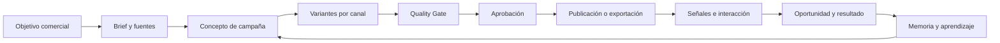

# Estudio estratégico de WIASocial multicanal

**Fecha:** 28 de julio de 2026  
**Mercado inicial:** España  
**Canales evaluados:** Instagram, Facebook, LinkedIn y X  
**Comprador prioritario:** agencias boutique que gestionan varias marcas  
**Horizonte:** validación de 90 días y construcción por fases durante 12-18 meses  
**Documentos relacionados:** [estudio de mercado inicial](./ESTUDIO-MERCADO-WIASOCIAL-2026.md), [auditoría técnica](./AUDITORIA-TECNICA-WIASOCIAL-2026.md) y [roadmap del módulo 1](./modulos/01-content-studio-premium/README.md).

---

## 1. Respuesta corta

### Veredicto

WIASocial tiene potencial comercial, pero no como otro planificador con un botón de IA.

El mercado de gestión social ya está muy cubierto. Metricool, Buffer, SocialPilot, Sendible, Hootsuite, Sprout Social y Vista Social publican, analizan y gestionan varias redes. Predis.ai, SocialBee, FeedHive y Ocoya ya generan contenido. Planable domina el flujo de revisión y aprobación. Manychat automatiza conversaciones. HighLevel y HubSpot conectan actividad social con CRM y resultados comerciales.

Por tanto, esta propuesta sería débil:

> “Una herramienta que genera publicaciones con IA y las programa en Instagram, Facebook, LinkedIn y X”.

Es fácil de copiar, compite por precio y obliga a alcanzar en pocos meses una amplitud que otros productos llevan años construyendo.

La propuesta con mayor potencial es distinta:

> **WIASocial convierte un objetivo comercial y el conocimiento real de una marca en una campaña multicanal adaptada a cada red, coordina la aprobación, identifica señales de intención y aprende de los resultados que importan al negocio.**

En una frase más comercial:

> **De objetivo comercial a campaña aprobada, conversación y resultado, para todas las marcas de una agencia.**

### Evaluación

| Enfoque | Potencial | Motivo |
|---|---:|---|
| Planificador multicanal genérico | 3/10 | Mercado maduro, precios bajos y funciones indiferenciadas. |
| Generador de posts e imágenes | 4/10 | Existe demanda, pero la generación ya es una capacidad básica. |
| Herramienta de aprobación para agencias | 6/10 | Dolor real, aunque Planable, Sendible, SocialPilot y Metricool ya compiten bien. |
| Sistema de campañas y resultados para agencias | **7,5/10** | Une contenido, contexto, aprobación, señales comerciales y aprendizaje. |
| Preparación técnica actual para venderlo | **4,1/10** | La auditoría detectó bloqueantes de datos, seguridad, multi-tenancy, pruebas y operación. |

### Dónde puede obtener mayor provecho

1. Agencias españolas de 2 a 15 personas que gestionan entre 5 y 25 marcas.
2. Marcas de servicios con valor alto por lead: clínicas, inmobiliarias, formación, consultoría, fitness, hostelería premium y servicios profesionales.
3. Dos paquetes de canal, en vez de exigir cuatro redes a todos:

| Paquete | Canales | Trabajo principal |
|---|---|---|
| Demanda local | Instagram + Facebook | Descubrimiento, deseo, confianza local, mensajes y reservas. |
| Autoridad B2B | LinkedIn + X | Opinión experta, reputación, conversación y generación de demanda. |

La agencia puede combinar ambos paquetes según cada cliente. Esto evita vender “cuatro redes” a negocios que solo necesitan dos.

### Qué no construir primero

- otro calendario social completo;
- un editor gráfico equivalente a Canva;
- un sistema de escucha global equivalente a Brandwatch;
- publicación simultánea en todas las redes antes de resolver la arquitectura multi-marca;
- un modelo fundacional propio;
- automatizaciones que publiquen o contesten sin aprobación;
- una promesa de atribución perfecta de cada venta a una publicación.

---

## 2. Decisiones recomendadas

Este estudio propone tomar las siguientes decisiones de producto.

| Decisión | Recomendación |
|---|---|
| Arquitectura | Multicanal desde el modelo de dominio. |
| Lanzamiento | Por fases, no cuatro integraciones completas a la vez. |
| Cliente inicial | Agencias boutique, no “cualquier negocio o creador”. |
| Primeros canales | Instagram y Facebook, por afinidad comercial y ecosistema Meta. |
| LinkedIn | Crear y exportar desde el principio; publicar cuando se apruebe Community Management. |
| X | Generación y exportación primero; API como complemento medido y opcional. |
| IA | Proveedores intercambiables con memoria, fuentes, reglas y evaluación propias. |
| Creatividad | IA para el activo visual; composición final determinista y editable. |
| Posicionamiento | Sistema de campaña y resultados, no planificador. |
| Distribución | Venta asistida a agencias y expansión por número de marcas. |
| Precio | Por workspace y marcas, con créditos para operaciones caras. |
| Métrica principal | Tiempo hasta campaña aprobada y señales comerciales atribuibles. |

La idea central es importante:

> **Ser multicanal debe ser una propiedad del producto, no su mensaje principal.**

Los clientes no pagan por el número de logotipos de redes disponibles. Pagan por producir mejor, coordinar menos, conservar clientes y demostrar valor.

---

## 3. Alcance y método

### Preguntas investigadas

1. ¿Hay suficiente demanda para una plataforma multicanal?
2. ¿Qué función cumple cada red para los clientes de WIASocial?
3. ¿Quién pagaría y por qué cambiaría su proceso actual?
4. ¿Qué competidores cubren ya cada parte del flujo?
5. ¿Qué capacidades son básicas y cuáles pueden diferenciar?
6. ¿Qué permiten realmente las APIs?
7. ¿Qué tamaño de mercado puede defenderse sin inflarlo?
8. ¿Qué producto, precio y estrategia de entrada son razonables?
9. ¿Qué debe demostrarse antes de invertir en una plataforma completa?

### Fuentes

Se han priorizado:

- datos oficiales de INE y Eurostat;
- informes de audiencia de DataReportal con sus advertencias metodológicas;
- estudio de redes de IAB Spain;
- documentación oficial de Meta, LinkedIn y X;
- páginas de producto y precio de cada competidor;
- estudios de la industria con metodología publicada;
- evidencia técnica del repositorio actual.

### Límites

- Las audiencias publicitarias no equivalen a usuarios activos mensuales.
- LinkedIn informa miembros registrados, una medida distinta a la de otras redes.
- Los precios cambian y pueden variar por región, impuestos y facturación anual.
- No existe una estadística pública de empresas dispuestas a comprar WIASocial.
- Los cálculos TAM, SAM y SOM son escenarios explícitos, no previsiones financieras.
- Las entrevistas y pilotos siguen siendo necesarios para validar disposición a pagar.

---

## 4. Señales de mercado

### 4.1 Las redes son una infraestructura comercial consolidada

DataReportal estima **39 millones de identidades activas en redes sociales en España** en octubre de 2025, un 81,4 % de la población. Entre mayores de 18 años, la cifra equivalía al 87,1 % de la población adulta. La propia fuente advierte que una identidad no siempre representa una persona única. [Fuente: Digital 2026 Spain](https://datareportal.com/reports/digital-2026-spain).

IAB Spain comunicó en su Estudio de Redes Sociales 2026:

- 33 millones de españoles usan redes sociales;
- el usuario medio visita 7,2 redes, frente a 5,3 en 2025;
- el 44 % reconoce su influencia en decisiones de compra;
- más de la mitad busca información sobre marcas y productos antes de comprar online;
- el 87 % considera imprescindible etiquetar el contenido generado con IA.

[Fuente: presentación del Estudio de Redes Sociales 2026 de IAB Spain](https://es.linkedin.com/posts/iab-spain_iabestudiorrss-activity-7462442059384188928-kdBR).

La conclusión no es que cada empresa deba publicar en siete redes. Significa que el recorrido del comprador está fragmentado y que una marca puede ser descubierta, validada y contactada en canales diferentes.

### 4.2 Las empresas ya utilizan estas redes

Eurostat indica que en 2025 el 63,6 % de las empresas de la UE con al menos diez trabajadores utilizaba algún tipo de red social. El porcentaje era del 60,6 % entre pequeñas empresas, 76,2 % entre medianas y 89,1 % entre grandes. Los usos incluyen presencia, marketing, comunicación con clientes y colaboración. [Fuente: Eurostat](https://ec.europa.eu/eurostat/de/web/products-eurostat-news/w/ddn-20260612-2).

España tenía **3.310.824 empresas activas** a 1 de enero de 2025 y aproximadamente el 95 % eran microempresas con menos de diez asalariados. [Fuente: INE, DIRCE 2025](https://ine.es/dyngs/Prensa/es/DIRCE2025.htm).

Esto crea una paradoja útil para WIASocial:

- hay muchísimas empresas que necesitan presencia social;
- la mayoría no tiene un equipo interno especializado;
- el mercado directo es grande, pero disperso, sensible al precio y costoso de atender;
- las agencias son un canal de distribución más eficiente.

### 4.3 Producir contenido sigue siendo difícil

En una encuesta a más de 1.100 profesionales, HubSpot informa que:

- el 45 % considera que producir contenido de calidad de forma constante es su principal reto;
- el 94 % ya utiliza IA en alguna parte del flujo social;
- el 77 % cree que la autenticidad supera al valor de producción;
- el 41 % considera más difícil que nunca destacar de forma orgánica.

[Fuente: HubSpot Social Media Marketing Report 2026](https://blog.hubspot.com/marketing/hubspot-blog-social-media-marketing-report).

Esto invalida una idea habitual: añadir IA no resuelve automáticamente el problema. La IA aumenta el volumen disponible y, a la vez, hace que más marcas suenen iguales.

### 4.4 La fragmentación del proceso es una oportunidad

Según el mismo estudio de HubSpot:

- el 93 % espera mantener o ampliar su conjunto de herramientas;
- solo el 36 % considera que su stack está muy cohesionado o totalmente integrado;
- solo el 37 % considera fácil conectar actividad social con resultados de negocio;
- el 69 % declara una presión creciente para demostrar retorno;
- solo el 13,54 % usa IA para escucha social y detección de tendencias.

El hueco no está en “generar otra frase”. Está entre herramientas que no comparten bien el contexto:

```text
brief del cliente
  -> ideas y fuentes
  -> copy
  -> imagen o vídeo
  -> revisión
  -> programación
  -> conversación
  -> lead u oportunidad
  -> informe
```

WIASocial debe reducir traspasos, repetición de contexto y pérdida de información en ese recorrido.

---

## 5. Papel de cada canal

### 5.1 Audiencia en España

Las siguientes cifras proceden de herramientas publicitarias y deben leerse como alcance potencial, no como usuarios activos comparables.

| Red | Indicador en España, final de 2025 | Lectura estratégica |
|---|---:|---|
| Instagram | 26,4 M de audiencia publicitaria | Principal canal visual del producto inicial. |
| Facebook | 20,3 M de audiencia publicitaria | Relevante para negocio local, comunidad, eventos y público adulto. |
| LinkedIn | 24,0 M de miembros registrados | Gran superficie B2B, aunque no comparable con usuarios activos. |
| X | 9,75 M de audiencia publicitaria | Menor alcance, útil en conversación, actualidad y voz de expertos. |
| TikTok | 20,9 M de adultos alcanzables | No debe ignorarse en el roadmap, aunque no entre en la primera fase. |

Fuente: [DataReportal, Digital 2026 Spain](https://datareportal.com/reports/digital-2026-spain).

### 5.2 Instagram

**Trabajo principal:** crear deseo, demostrar, inspirar confianza y abrir una conversación.

Formatos importantes:

- carruseles educativos o narrativos;
- Reels;
- publicaciones visuales;
- Stories;
- comentarios y mensajes.

Sectores con mejor encaje:

- hostelería y experiencias;
- clínicas y bienestar;
- inmobiliario;
- fitness;
- moda, belleza y comercio;
- formación B2C.

Oportunidad para WIASocial:

- convertir una oferta en concepto visual y secuencia;
- separar la imagen generada de la composición final;
- conectar comentarios y mensajes con señales comerciales;
- aprender qué combinación de promesa, prueba y llamada a la acción funciona.

### 5.3 Facebook

**Trabajo principal:** reforzar confianza local, mantener comunidad, anunciar novedades y conducir tráfico o conversación.

No debe tratarse como una copia automática de Instagram. En Facebook suelen tener más sentido:

- textos con mayor contexto;
- eventos y novedades locales;
- enlaces;
- ofertas y horarios;
- prueba social;
- conversación comunitaria.

Sectores con mejor encaje:

- restauración y comercio local;
- educación;
- servicios para familias;
- inmobiliario;
- asociaciones, eventos y ocio;
- negocios con público adulto.

La ventaja de añadir Facebook junto a Instagram es operativa: una misma campaña puede compartir objetivo, activos y medición, pero necesita una ejecución diferente.

### 5.4 LinkedIn

**Trabajo principal:** crear autoridad, reputación y demanda B2B.

Casos de uso:

- opinión del fundador o experto;
- aprendizaje de proyectos;
- casos de cliente;
- documentos y contenido educativo;
- contratación y marca empleadora;
- contenido de página de empresa;
- activación de empleados.

Sectores con mejor encaje:

- consultoría;
- software y tecnología;
- servicios profesionales;
- formación B2B;
- agencias;
- selección y recursos humanos;
- inmobiliario corporativo.

LinkedIn es especialmente interesante porque el contenido de calidad depende menos de “hacer una imagen bonita” y más de extraer conocimiento real de llamadas, proyectos, expertos y clientes. WIASocial puede diferenciarse si ayuda a capturar ese conocimiento y no se limita a fabricar textos genéricos.

Riesgo: el acceso completo a Community Management está sujeto a revisión y niveles de acceso. La estrategia comercial no debe depender de obtener la aprobación inmediatamente.

### 5.5 X

**Trabajo principal:** participar en conversación en tiempo real y construir una voz reconocible.

Casos de uso:

- opinión y reacción a actualidad;
- hilos explicativos;
- distribución de ideas;
- escucha de temas seleccionados;
- cuentas de fundador o experto;
- tecnología, política pública, finanzas, medios y deporte.

No es un canal prioritario para todos los negocios locales. Sí puede aportar mucho a una consultora, fundador, medio, empresa tecnológica o marca que compita mediante conversación y velocidad.

La API de X es de pago por uso. Esto obliga a tratar lectura, escucha y automatización como funciones medibles, con presupuesto por workspace.

### 5.6 TikTok, la ausencia que debe vigilarse

Aunque el alcance inicial de este estudio se centra en cuatro redes, TikTok registraba 20,9 millones de adultos alcanzables en España y un crecimiento publicitario comunicado del 15,9 % interanual. Excluirlo para siempre reduciría el potencial en comercio, hostelería, belleza, ocio y marcas dirigidas a públicos jóvenes.

La recomendación es posponerlo por tres motivos:

1. exige una capacidad de vídeo y producción diferente;
2. añade otra revisión de plataforma y formatos;
3. el producto debe demostrar antes que su bucle de campaña y aprendizaje funciona.

Debe existir una revisión formal de TikTok al completar la fase Meta, no una promesa de fecha desde ahora.

### 5.7 Selección por cliente

| Tipo de cliente | Canal primario | Canal secundario | Canal opcional |
|---|---|---|---|
| Restaurante premium | Instagram | Facebook | TikTok futuro |
| Clínica | Instagram | Facebook | LinkedIn corporativo |
| Inmobiliaria residencial | Instagram | Facebook | LinkedIn |
| Consultoría B2B | LinkedIn | X | Instagram |
| Agencia | LinkedIn | Instagram | X |
| Formación B2C | Instagram | Facebook | TikTok futuro |
| Software B2B | LinkedIn | X | YouTube futuro |

El producto debe recomendar una mezcla de canales a partir del objetivo y la audiencia. No debe fomentar presencia indiscriminada.

---

## 6. Compradores y problemas

### 6.1 ICP principal

**Agencia española de 2 a 15 personas que gestiona entre 5 y 25 clientes de redes sociales.**

Características:

- utiliza Canva y una herramienta de programación;
- comparte materiales por Drive, WhatsApp o correo;
- genera textos con ChatGPT u otra IA;
- tiene cuellos de botella en obtención de información y aprobaciones;
- dedica tiempo manual a adaptar, programar e informar;
- necesita justificar su cuota mensual al cliente;
- no quiere contratar una persona por cada cinco cuentas nuevas.

### 6.2 Trabajo que intenta resolver

La agencia no busca “un post”. Busca completar este trabajo:

1. entender qué quiere vender el cliente este mes;
2. obtener información, imágenes, ofertas, fechas y restricciones;
3. convertirlo en un plan coherente;
4. producir piezas distintas por canal;
5. evitar errores de marca y afirmaciones inventadas;
6. conseguir aprobación sin perseguir al cliente;
7. publicar o entregar el contenido;
8. responder y detectar oportunidades;
9. explicar qué funcionó y qué debe cambiar;
10. renovar la relación.

### 6.3 Dolor económico

Los costes ocultos no están solo en diseñar:

- horas de coordinación;
- revisiones sin contexto;
- retrabajo por cambios tardíos;
- publicaciones genéricas que el cliente rechaza;
- informes que cuentan impresiones sin explicar negocio;
- oportunidades que se pierden en mensajes;
- rotación de clientes por percepción de poco valor.

Un producto que ahorra diez horas pero no mejora la retención puede venderse. Un producto que además ayuda a conservar un cliente de agencia o detectar oportunidades tiene una disposición a pagar mayor.

### 6.4 Comprador secundario

**Negocio de servicios con una persona responsable de marketing y un valor alto por lead.**

Debe cumplir varias condiciones:

- genera al menos 8-12 piezas mensuales;
- utiliza dos o más redes de forma comercial;
- puede aportar fuentes y pruebas reales;
- alguien revisa y aprueba;
- una reserva, consulta o venta tiene valor suficiente;
- está dispuesto a medir enlaces, mensajes y oportunidades.

No conviene empezar por autónomos que publican ocasionalmente, creadores de ocio ni microempresas que buscan un planificador de 10 €.

### 6.5 Usuario, comprador y beneficiario

| Rol | Necesidad |
|---|---|
| Community manager | Menos trabajo repetitivo y mejor primer borrador. |
| Responsable de cuenta | Contexto, aprobación y seguimiento. |
| Director de agencia | Margen, capacidad, retención y expansión. |
| Cliente final | Calidad, control, seguridad y claridad del resultado. |
| Comercial | Señales y conversaciones que pueda trabajar. |

El producto debe generar valor para todos sin obligar al cliente final a aprender una plataforma compleja.

---

## 7. Tamaño de mercado

### 7.1 Principio metodológico

Añadir cuatro redes no multiplica el mercado por cuatro. Una agencia que gestiona cuatro canales sigue siendo una agencia. El efecto real es:

- mayor número de casos de uso;
- mayor valor por workspace;
- menor riesgo de quedar encerrado en una sola red;
- mayor complejidad de producto y soporte;
- posible aumento de ARPA si se demuestra valor.

### 7.2 Base de agencias

Una base sectorial privada sitúa en aproximadamente 42.344 las empresas españolas clasificadas en CNAE 7311, agencias de publicidad. La cifra incluye negocios sin gestión social y debe tratarse como techo amplio. [Fuente: eInforma, CNAE 7311](https://www.einforma.com/informes-sectoriales/cnae-7311-empresas-agencias-de-publicidad).

Supuestos:

- entre el 15 % y el 25 % tiene tamaño, servicio social y proceso compatibles;
- mercado potencial: 6.350-10.600 agencias;
- ARPA multicanal sostenible: 249-349 € al mes.

| Escenario | Agencias | ARPA | TAM anual |
|---|---:|---:|---:|
| Prudente | 6.350 | 249 € | 19,0 M€ |
| Alto | 10.600 | 349 € | 44,4 M€ |

Este es el TAM más útil para la decisión porque coincide con el comprador recomendado.

### 7.3 Negocios directos

El estudio anterior identificó 2.038.005 empresas en sectores amplios con posible encaje. Solo una fracción utiliza redes de forma suficientemente comercial, tiene recursos y pagaría por una plataforma.

No se recomienda utilizar el total para justificar la inversión. El mercado directo debe tratarse como expansión o distribución mediante agencias.

### 7.4 SAM inicial

Para los primeros tres años:

- España;
- agencias de 2-15 personas;
- entre 5 y 25 marcas;
- clientes de servicios locales o B2B;
- castellano;
- disposición a adoptar un producto asistido.

| Escenario | Agencias servibles | ARPA | SAM anual |
|---|---:|---:|---:|
| Prudente | 3.000 | 249 € | 9,0 M€ |
| Alto | 5.000 | 299 € | 17,9 M€ |

El SAM inicial razonable es, por tanto, **9-18 M€ anuales en España**, antes de sumar venta directa, otros países o productos complementarios.

### 7.5 SOM a 36 meses

| Escenario | Agencias activas | ARPA | ARR |
|---|---:|---:|---:|
| Conservador | 100 | 249 € | 298.800 € |
| Base | 250 | 299 € | 897.000 € |
| Exigente | 500 | 349 € | 2.094.000 € |

Una agencia puede representar entre 5 y 25 marcas. El escenario base de 250 agencias podría poner WIASocial detrás de 2.000-4.000 marcas sin adquirir cada una de forma directa.

### 7.6 Lectura de inversión

El mercado español puede sostener un SaaS especializado de varios millones de ARR. Para aspirar a más de 5-10 M€ de ARR, probablemente serán necesarias una o varias expansiones:

- Latinoamérica;
- Portugal, Italia o Francia;
- agencias medianas y multiubicación;
- TikTok, YouTube o Google Business Profile;
- módulos de conversación, reputación o atribución;
- un canal de partners.

No es necesario demostrar ese mercado global antes del piloto. Sí es necesario evitar una arquitectura que lo impida.

---

## 8. Competidores

### 8.1 El mercado no tiene un único competidor

WIASocial compite contra una combinación de productos.

| Categoría | Productos | Qué resuelven |
|---|---|---|
| Gestión social | Metricool, Buffer, SocialPilot, Sendible, Hootsuite, Sprout Social, Agorapulse | Publicación, calendario, analítica, bandeja y reporting. |
| IA y creación | Predis.ai, SocialBee, FeedHive, Ocoya, Canva | Ideas, copy, imagen, vídeo, carruseles y reutilización. |
| Colaboración | Planable, Sendible, SocialPilot | Revisión, comentarios, roles y aprobación de clientes. |
| Conversación | Manychat, Vista Social | Mensajes, comentarios, automatización y captación. |
| CRM y atribución | HighLevel, HubSpot | Contactos, automatización, campañas, pipeline y ROI. |
| Escucha | Brandwatch, Sprinklr, Talkwalker, Mention, Brand24 | Tendencias, menciones, sentimiento y riesgo de marca. |

El competidor real suele ser un stack como este:

```text
ChatGPT + Canva + Metricool + Drive + WhatsApp + informe manual
```

La sustitución debe demostrar que reduce trabajo y mejora el resultado más de lo que cuesta cambiar el proceso.

### 8.2 Referencias de precio actuales

Precios públicos consultados en julio de 2026. Se muestran planes representativos y, cuando procede, facturación anual.

| Producto | Precio de referencia | Capacidad relevante |
|---|---:|---|
| Metricool | 16 €/mes, 5 marcas; 29 €, 10; Advanced desde 43 € | Multicanal, analítica, informes y aprobación. X cuesta 5 € por cuenta. |
| Buffer | 5 USD/canal Essentials; 10 USD/canal Team | Publicación simple, IA, analítica y aprobaciones. |
| SocialPilot | 85 USD/mes Premium anual | 20 cuentas, 6 usuarios, IA, aprobación y white label. |
| Vista Social | 79 USD Professional; 149 Advanced; 349 Scale | Plataforma completa, IA contextual, bandeja, automatización y escucha opcional. |
| Planable | 33 USD/workspace Basic; 49 Pro | Colaboración, visualización y aprobaciones. Analítica aparte. |
| Predis.ai | 19 USD Core; 40 Rise; 212 Enterprise+ | Generación de imagen, vídeo, carrusel, copy y publicación. |
| SocialBee | 29 USD Bootstrap; 49 Accelerate; 99 Pro | IA, categorías, reutilización, publicación y aprobación. |
| FeedHive | 15 € Creator; 22 Brand; 69 Business; 239 Agency | IA, automatizaciones, predicción, API y workspaces. |
| Ocoya | 15 USD Bronze; 39 Silver; 79 Gold; 159 Diamond | Creación, créditos, programación y equipos. |
| Hootsuite | desde 99 USD por usuario | Gestión completa, IA, escucha e inbox. |
| Sprout Social | 79 USD Essentials; 199 Standard; 299 Professional; 399 Advanced, por usuario | Suite avanzada, atención, escucha, analítica y workflows. |
| Manychat | 14 USD Essential; 29 Pro; 69 Business | Automatización de mensajes y comentarios, contactos y conversación. |
| HighLevel | 97 USD Starter; 297 Unlimited; 497 Agency Pro | CRM, automatización, subcuentas, social planner y SaaS white label. |

Fuentes: [Metricool](https://metricool.com/es/premium/), [Buffer](https://buffer.com/pricing), [SocialPilot](https://www.socialpilot.co/pricing), [Vista Social](https://vistasocial.com/pricing/), [Planable](https://planable.io/pricing/), [Predis.ai](https://predis.ai/pricing/), [SocialBee](https://socialbee.com/pricing/), [FeedHive](https://www.feedhive.com/pricing), [Ocoya](https://www.ocoya.com/pricing), [Hootsuite](https://www.hootsuite.com/plans), [Sprout Social](https://sproutsocial.com/pricing/), [Manychat](https://manychat.com/pricing) y [HighLevel](https://www.gohighlevel.com/pricing).

### 8.3 Competidores más peligrosos

#### Metricool

Es la referencia española y ejerce una presión de precio muy fuerte. Ofrece planificación, analítica, informes, competidores, aprobación y asistente de IA. Su ventaja es amplitud con una marca conocida y un precio bajo.

WIASocial no debe intentar derrotarlo en calendario y estadísticas básicas. Puede convivir con Metricool durante los pilotos y sustituir partes del flujo cuando exista una ventaja demostrada.

#### Vista Social

Es el competidor estratégico más serio para la visión de “sistema operativo social”. Ask Vista ya trabaja con perfiles, calendario, bandeja, analítica, tareas, informes y contenido; mantiene aprobación antes de acciones públicas y permite entrenar conocimiento en planes superiores. [Fuente: Ask Vista](https://vistasocial.com/insights/conversational-ai-social-media/).

Esto demuestra dos cosas:

1. la dirección de producto es válida;
2. una interfaz conversacional y memoria de marca ya no bastan para diferenciar.

WIASocial necesita especialización en agencias, calidad de campaña y resultados comerciales.

#### Predis.ai

Es el rival directo del módulo de creación. Genera imágenes, vídeos, carruseles, anuncios, textos y hashtags; conecta varias marcas y publica en múltiples canales. A 40 USD mensuales ofrece cuatro marcas y veinte canales.

No conviene competir por número de generaciones. WIASocial debe competir por la calidad del brief, la evidencia, la aprobación y el aprendizaje posterior.

#### Planable

Ha construido una posición clara alrededor de colaboración y aprobación. Su modelo por workspace con usuarios ilimitados es fácil de entender para agencias.

WIASocial debe tratar la aprobación como infraestructura básica, no como diferenciador único.

#### HighLevel

Es especialmente peligroso para agencias que quieren CRM, automatización, subcuentas y reventa. Su Social Planner ya reúne publicación, plantillas, aprobaciones, analítica, enlaces medibles y varias redes. [Fuente: HighLevel Social Planner](https://help.gohighlevel.com/support/solutions/articles/155000005063-launchpad-setup-social-planner).

Su debilidad es la amplitud y complejidad. WIASocial puede ganar por especialización, experiencia creativa, menor tiempo de configuración y claridad de campaña.

#### HubSpot

HubSpot ya conecta publicaciones, palabras clave, interacciones, contactos, campañas, leads y clientes. Es una prueba de que la atribución social tiene valor, pero su precio y complejidad están fuera del alcance de muchas agencias boutique. [Fuente: HubSpot Social Media Management](https://www.hubspot.com/products/marketing/social-inbox).

WIASocial puede ofrecer una versión más enfocada y accesible, no una réplica del CRM completo.

### 8.4 Matriz de capacidades

Leyenda: **F** fuerte, **M** media, **B** básica o parcial, **N** no es parte central del producto.

| Producto | Crear con IA | Imagen/vídeo | Adaptación por red | Aprobar | Publicar | Analítica | Inbox/señales | CRM/resultado | IA con datos de cuenta |
|---|:---:|:---:|:---:|:---:|:---:|:---:|:---:|:---:|:---:|
| Metricool | M | B | M | M | F | F | M | B | M |
| Vista Social | F | M | F | F | F | F | F | M | F |
| Predis.ai | F | F | M | M | F | M | N | N | M |
| Planable | M | B | M | F | F | M | M | N | B |
| SocialPilot | M | B | M | F | F | F | M | N | M |
| HighLevel | M | B | M | M | F | M | F | F | M |
| HubSpot | M | B | M | M | F | F | F | F | F |
| Manychat | B | N | N | N | N | B | F | F | M |
| Canva | M | F | B | M | M | B | N | N | M |
| WIASocial objetivo | F | F | **F** | F | M/F | F | **F** | **F** | **F** |

El espacio más libre no es una columna. Es la combinación:

```text
campaña bien fundamentada
+ adaptación nativa
+ aprobación de agencia
+ señal comercial
+ aprendizaje por resultado
```

### 8.5 Qué funciones ya son básicas

No deben aparecer como ventaja principal:

- calendario;
- programación;
- generación de captions;
- hashtags;
- mejor hora para publicar;
- analítica de alcance e interacción;
- reutilización de un texto;
- biblioteca de activos;
- acceso de equipo;
- aprobación simple;
- un chatbot sin acceso a datos reales;
- “tono de marca” basado en tres adjetivos.

---

## 9. Hueco de mercado

### 9.1 El flujo que queda mal resuelto

Las herramientas existentes suelen empezar en el contenido o terminar en la publicación. La agencia empieza antes y termina después.

```text
objetivo del negocio
  -> campaña
  -> argumentos y pruebas
  -> versiones por canal
  -> revisión
  -> publicación
  -> reacción
  -> señal de intención
  -> oportunidad
  -> aprendizaje
```

Los huecos más interesantes son:

1. traducir objetivos comerciales a campañas ejecutables;
2. extraer material auténtico de la empresa;
3. evitar afirmaciones no sustentadas;
4. adaptar de verdad, no redimensionar y copiar;
5. mantener el contexto durante revisiones;
6. clasificar conversaciones e intención;
7. vincular contenido con oportunidades sin prometer atribución perfecta;
8. aprender de aceptaciones, rechazos y resultados.

### 9.2 El verdadero producto

WIASocial no debería organizarse alrededor de “crear post”. La unidad de trabajo debe ser la **campaña**.

Una campaña contiene:

- objetivo comercial;
- audiencia;
- oferta o mensaje;
- fuente de verdad;
- restricciones y afirmaciones permitidas;
- concepto creativo;
- piezas por red;
- responsables y aprobadores;
- enlaces y llamadas a la acción;
- resultados y aprendizajes.

### 9.3 Ejemplo

Objetivo:

```text
conseguir reservas de menú omakase entre semana
```

Salida correcta:

| Canal | Pieza |
|---|---|
| Instagram | Carrusel visual centrado en experiencia, detalle y reserva. |
| Facebook | Publicación con contexto, disponibilidad, ubicación y enlace. |
| LinkedIn | Solo si tiene sentido: historia empresarial, hospitalidad o evento corporativo. |
| X | Solo si existe una voz activa: observación sobre producto, ciudad o cultura gastronómica. |

La salida incorrecta es publicar el mismo titular y la misma imagen en cuatro sitios.

---

## 10. Ventaja defendible

### 10.1 Lo que no es una defensa

- utilizar ChatGPT, Gemini, Claude u otro modelo;
- generar imágenes de alta calidad;
- tener prompts “secretos”;
- soportar cuatro redes;
- escribir en castellano;
- disponer de plantillas;
- mostrar un asistente conversacional;
- ofrecer muchas generaciones por poco dinero.

Los proveedores y competidores pueden copiar estas capacidades.

### 10.2 Capas que sí pueden acumular valor

#### Memoria de marca basada en evidencia

No basta con colores y tono. Debe incluir:

- servicios y ofertas;
- audiencias;
- afirmaciones permitidas y prohibidas;
- casos, cifras y testimonios con fuente;
- objeciones comerciales;
- vocabulario aprobado;
- ejemplos aceptados y rechazados;
- historial de campañas;
- resultados.

#### Grafo de campaña

La relación entre objetivo, mensaje, pieza, canal, conversación y resultado debe quedar registrada. Esto permite comparar campañas y no solo publicaciones aisladas.

#### Adaptación nativa

El mismo argumento debe cambiar de estructura, profundidad, creatividad y llamada a la acción según la red.

#### Calidad comprobable

Un Quality Gate debe evaluar:

- fidelidad a fuentes;
- claridad de promesa;
- especificidad;
- adecuación al canal;
- coherencia visual;
- legibilidad;
- riesgo reputacional o regulatorio;
- similitud excesiva con piezas anteriores;
- fuerza de la llamada a la acción.

#### Datos de decisión

Guardar:

- qué variante se eligió;
- qué modificó el humano;
- por qué se rechazó;
- cuánto tardó en aprobarse;
- qué respuesta generó;
- qué señal comercial produjo;
- si acabó en oportunidad o venta, cuando pueda conocerse.

Con suficiente volumen, este conjunto de datos puede mejorar recomendaciones por sector y objetivo.

#### Integración en el proceso de agencia

El coste de cambiar crece cuando la agencia tiene:

- marcas configuradas;
- fuentes aprobadas;
- historial de campañas;
- permisos;
- clientes acostumbrados a aprobar;
- informes;
- playbooks propios;
- integraciones con CRM y publicación.

Esta defensa es legítima si aporta valor. No debe depender de bloquear la exportación de datos.

### 10.3 La ventaja en una frase

> **WIASocial aprende qué campañas aprueba cada cliente y qué señales comerciales producen, para crear mejores variantes por canal sin volver a explicar la marca cada semana.**

### 10.4 Ventaja inicial y ventaja futura

| Momento | Ventaja posible |
|---|---|
| Día 1 | Mejor proceso asistido y enfoque en agencias españolas. |
| Mes 3 | Playbooks y memoria por cliente obtenidos en pilotos. |
| Mes 6 | Datos de aprobación, edición y calidad. |
| Mes 12 | Relación entre campaña, señal y resultado en varias marcas. |
| Mes 18+ | Recomendaciones por vertical basadas en evidencia propia. |

WIASocial no tiene hoy un moat. Puede construirlo si captura los datos correctos desde el primer piloto.

---

## 11. Estrategia de IA

### 11.1 No hace falta “otra IA” fundacional

Entrenar un modelo grande propio sería caro, lento e innecesario. La personalización útil se consigue mediante una arquitectura compuesta:

```text
modelo general de texto
+ modelo de imagen o vídeo
+ memoria de marca
+ recuperación de fuentes
+ playbooks por vertical
+ reglas por canal
+ evaluadores
+ aprobación humana
+ datos de resultado
```

El valor reside en la orquestación, los datos y el proceso, no en poseer los pesos de un modelo.

### 11.2 Proveedores intercambiables

WIASocial debe poder elegir modelo por tarea:

| Tarea | Criterio principal |
|---|---|
| Estrategia y razonamiento | Calidad y uso correcto de fuentes. |
| Copy corto | Coste, velocidad y consistencia. |
| Copy experto | Fidelidad y voz. |
| Imagen inicial | Calidad y capacidad de seguir dirección artística. |
| Edición de imagen | Conservación de producto, identidad y composición. |
| Evaluación | Bajo coste, contrato estructurado y reproducibilidad. |

Esto permite cambiar de OpenAI a Google, Anthropic u otro proveedor sin rehacer el producto.

### 11.3 Captura de conocimiento real

La mejor fuente de contenido no es un prompt vacío. Es material como:

- transcripción de una llamada con el cliente;
- audio del fundador;
- preguntas de ventas;
- reseñas;
- preguntas frecuentes;
- catálogo;
- casos de cliente;
- páginas web;
- ofertas y calendario comercial;
- informes anteriores.

WIASocial debe ayudar a convertir estas fuentes en ángulos y piezas. Esto responde a la demanda de autenticidad y reduce contenido genérico.

### 11.4 Imagen y publicación final

La imagen generativa debe crear el activo principal, no componer a ciegas toda la publicación.

Flujo recomendado:

```text
dirección creativa
  -> imagen limpia, sin texto incrustado
  -> selección humana
  -> composición determinista
  -> tipografía, logotipo, CTA y márgenes
  -> revisión a tamaño móvil
  -> exportación por formato
```

Esto evita resultados como textos deformes, jerarquía arbitraria o piezas que parecen una diapositiva técnica en vez de una publicación real.

### 11.5 Aprendizaje sin autoengaño

No se debe optimizar solo por likes. El sistema necesita varios niveles:

| Nivel | Métricas |
|---|---|
| Producción | tiempo, coste, reintentos, tasa de aceptación; |
| Calidad | edición humana, rechazo, error factual, coherencia; |
| Distribución | alcance, impresiones, retención, clics; |
| Intención | guardados, comentarios relevantes, mensajes, formularios; |
| Negocio | oportunidades, reservas, pipeline, ventas cuando sea posible. |

El producto debe distinguir correlación, contribución y atribución. No toda venta puede asignarse a una publicación.

---

## 12. Viabilidad de las APIs

### 12.1 Resumen

| Red | Publicación | Analítica | Conversación | Escucha | Acceso/coste | Riesgo |
|---|---|---|---|---|---|---|
| Instagram | Fuerte para profesionales | Fuerte en datos propios | Comentarios y mensajes iniciados por usuario | Limitada | Revisión Meta, sin coste por llamada publicado | Medio |
| Facebook | Fuerte para páginas | Fuerte en páginas propias | Comentarios y Messenger con permisos | Limitada | Revisión Meta | Medio |
| LinkedIn | Fuerte tras aprobación | Buena para páginas y casos aprobados | Comentarios y reacciones | Muy limitada fuera de datos autorizados | Vetting y niveles | Alto |
| X | Posts, hilos, medios y encuestas | Pública y privada con límites | Respuestas y DM con restricciones | Posible, pero de pago | Pago por uso | Alto y variable |

### 12.2 Instagram

La API oficial permite a cuentas profesionales:

- publicar contenido;
- publicar Reels;
- obtener insights;
- gestionar comentarios;
- detectar menciones;
- utilizar mensajería bajo sus reglas.

Limitaciones relevantes:

- no cubre cuentas personales de consumidor;
- Stories están disponibles solo para cuentas business en el flujo documentado;
- una conversación de mensajes debe iniciarla el usuario;
- no hay mensajes de grupo;
- se necesitan permisos específicos y revisión para producción.

Fuente: [documentación oficial de Instagram en Postman](https://www.postman.com/meta/instagram/documentation/6yqw8pt/instagram-api).

### 12.3 Facebook

El caso razonable es la gestión de páginas, no perfiles personales:

- publicaciones de texto, enlace, imagen, vídeo y formatos compatibles;
- analítica de página y publicación;
- comentarios;
- Messenger bajo permisos y políticas;
- campañas y enlaces medibles.

WIASocial debe diseñar una única capa de integración Meta, pero separar capacidades, errores y tokens por cuenta. Compartir proveedor no significa que Instagram y Facebook tengan el mismo contrato de contenido.

### 12.4 LinkedIn

La Posts API admite contenido orgánico de texto, imagen, vídeo, documento, artículo, múltiples imágenes y encuestas. El carrusel orgánico como tipo específico no está soportado; sí lo está el documento que muchas herramientas presentan como carrusel. [Fuente: LinkedIn Posts API](https://learn.microsoft.com/en-us/linkedin/marketing/community-management/shares/posts-api?view=li-lms-2026-04).

La Community Management API permite, para casos aprobados:

- gestionar páginas de empresa;
- publicar, comentar y reaccionar;
- consultar administradores y roles;
- obtener seguidores, actividad y analítica;
- gestionar determinados casos de perfiles y employee advocacy.

El acceso no es automático:

- solo organizaciones legales registradas para casos comerciales;
- correo empresarial, nombre legal, dirección, web y privacidad;
- verificación por un superadministrador de la página;
- nivel Development limitado;
- nivel Standard con integración terminada, grabación y credenciales de prueba;
- LinkedIn puede rechazar una app y exigir crear otra;
- `r_member_social` permanece cerrado a nuevas solicitudes generales.

Fuentes: [Community Management Overview](https://learn.microsoft.com/en-us/linkedin/marketing/community-management/community-management-overview?view=li-lms-2026-06) y [App Review](https://learn.microsoft.com/en-us/linkedin/marketing/community-management-app-review?view=li-lms-2026-06).

Consecuencia:

> LinkedIn debe aportar valor mediante creación, revisión y exportación antes de depender de la publicación y analítica automática.

### 12.5 X

La API permite crear publicaciones, hilos, medios, encuestas y consultar métricas. Sin embargo, el modelo actual es de créditos por uso. [Fuente: X API Pricing](https://docs.x.com/x-api/getting-started/pricing).

Precios publicados en julio de 2026:

| Operación | Coste unitario |
|---|---:|
| Leer post | 0,005 USD por recurso |
| Leer usuario | 0,010 USD por recurso |
| Crear post | 0,015 USD por solicitud |
| Crear post con URL | 0,200 USD por solicitud |
| Tendencias | 0,010 USD por solicitud |
| Lectura de datos propios elegibles | 0,001 USD por recurso |

Restricciones relevantes:

- publicar una cita mediante `quote_tweet_id` requiere Enterprise;
- en autoservicio, solo se permite responder cuando la cuenta ha sido mencionada o citada por el autor original;
- las métricas no públicas, orgánicas y promocionadas solo están disponibles durante 30 días;
- los precios pueden cambiar;
- la escucha amplia puede consumir presupuesto de forma rápida.

Fuentes: [Create Post](https://docs.x.com/x-api/posts/create-post), [Manage Posts](https://docs.x.com/x-api/posts/manage-tweets/introduction) y [Metrics](https://docs.x.com/x-api/fundamentals/metrics).

Consecuencia:

- publicación y métricas propias pueden ser viables;
- escucha se cobra mediante créditos o add-on;
- debe existir un límite de gasto por workspace;
- X no debe incluirse como coste ilimitado en todos los planes.

### 12.6 Estrategia de conectores

| Fase | Capacidad |
|---|---|
| 1 | Crear, revisar y exportar para las cuatro redes. |
| 2 | Publicar y analizar Instagram + Facebook. |
| 3 | Comentarios, mensajes y señales Meta. |
| 4 | LinkedIn Pages tras revisión; exportación mientras tanto. |
| 5 | X como conexión opcional y medida. |
| 6 | Evaluar TikTok y Google Business Profile. |

Esta secuencia permite vender valor antes de completar todas las revisiones de plataforma.

---

## 13. Producto recomendado

### 13.1 Núcleo

#### Workspace de agencia

- miembros y roles;
- clientes y marcas;
- fuentes de conocimiento;
- cuentas sociales;
- créditos y costes;
- actividad y auditoría.

#### Campaign Studio

- objetivo;
- audiencia;
- oferta;
- fuentes;
- concepto;
- piezas por canal;
- calendario;
- medición.

#### Brand Memory

- identidad;
- voz;
- pruebas;
- restricciones;
- ejemplos;
- historial;
- rendimiento.

#### Quality Gate

- comprobación factual;
- adecuación al canal;
- coherencia visual;
- duplicación;
- legibilidad;
- riesgo;
- checklist humano.

#### Client Approval

- enlace sin fricción;
- vista por campaña y por canal;
- comentarios contextuales;
- versiones;
- aprobación parcial o completa;
- registro de cambios.

#### Signal Inbox

- comentarios y mensajes autorizados;
- clasificación por intención;
- asignación;
- respuesta sugerida;
- conversión en lead u oportunidad;
- consentimiento y trazabilidad.

#### Outcome Report

- qué se pretendía;
- qué se publicó;
- qué señales aparecieron;
- qué contribución puede demostrarse;
- qué aprender para la siguiente campaña.

### 13.2 Flujo ideal



### 13.3 Diferencia frente al producto actual

El repositorio actual ya tiene generación, Content Studio, Instagram, leads y analítica parcial. Para llegar a la visión faltan fundamentos:

- multi-tenancy real;
- entidad de marca independiente del usuario;
- varias cuentas sociales por marca;
- modelo de campaña y variantes;
- registro de generaciones y costes;
- publicación asíncrona e idempotente;
- versiones y aprobaciones;
- integración segura de credenciales;
- trazabilidad de señales y resultados.

La auditoría técnica concluyó que el sistema es un prototipo avanzado, no una base preparada para escalar a agencias. Añadir tres conectores ahora multiplicaría la deuda.

---

## 14. Modelo de negocio

### 14.1 No competir por precio con el planificador

Metricool empieza en 16 € y Predis.ai en 19 USD. WIASocial no puede justificar un precio mayor si solo ofrece las mismas funciones con otra interfaz.

Sí puede cobrar más si reduce horas, acelera aprobación y ayuda a demostrar valor al cliente.

### 14.2 Precio de validación

**Piloto de seis semanas:** 299-599 € por agencia, hasta tres marcas.

Incluye:

- configuración asistida;
- dos campañas por marca;
- creación y revisión;
- exportación o publicación disponible;
- informe de tiempo, calidad y señales;
- sesión de cierre.

El piloto debe ser de pago. Un piloto gratuito mide curiosidad, no disposición a pagar.

### 14.3 Precio posterior

| Plan | Precio orientativo | Incluye |
|---|---:|---|
| Business Pro | 79 €/mes | 1 marca, 4 canales de creación, aprobación simple y créditos. |
| Agency Starter | 179 €/mes | 5 marcas, equipo, cliente aprobador, campañas y créditos. |
| Agency Growth | 349 €/mes | 15 marcas, workflows, señales, informes, integraciones y más créditos. |
| Agency Scale | 649 €/mes | 35 marcas, white label, permisos avanzados, API y soporte prioritario. |
| Enterprise | A medida | Seguridad, SSO, volumen, SLA e integración. |

Estos precios son hipótesis que deben someterse al piloto.

### 14.4 Expansión de ingreso

- marcas adicionales;
- paquetes de imagen y vídeo;
- escucha de X y tendencias;
- automatización de mensajes;
- white label;
- onboarding y migración;
- conectores CRM;
- playbooks sectoriales premium;
- usuario de cliente con funciones avanzadas.

### 14.5 Economía unitaria

El coste del texto suele ser pequeño frente a imagen, vídeo, reintentos y soporte. El estudio anterior estimó como referencia un paquete visual con dos borradores medios y una versión final de alta calidad en aproximadamente 0,30 USD, sujeto a proveedor y calidad.

Objetivos:

- margen bruto de software superior al 75 %;
- coste variable de IA inferior al 15 % del ingreso;
- límite de gasto por workspace;
- borradores con modelos económicos;
- modelos caros solo para finalistas;
- caché y reutilización de activos;
- ninguna promesa de generación visual ilimitada de alta calidad;
- registro de coste, latencia, reintentos y aceptación.

### 14.6 Justificación de valor

Ejemplo prudente:

```text
15 horas ahorradas al mes
x 25 € de coste interno por hora
= 375 € de capacidad recuperada
```

Un plan de 179 € puede justificarse antes de contar retención, mayor volumen o leads. La venta debe medir este ahorro en el piloto.

---

## 15. Estrategia de entrada

### 15.1 Posicionamiento

Evitar:

> “La IA que crea todas tus redes sociales”.

Recomendado:

> **WIASocial ayuda a agencias a convertir objetivos de cliente en campañas adaptadas a cada red, aprobarlas más rápido y demostrar las señales de negocio que generan.**

### 15.2 Entrada por un problema, no por una suite

Mensaje inicial:

```text
Reduce el tiempo entre el brief del cliente y una campaña aprobada.
```

Segundo mensaje, cuando haya evidencia:

```text
Conecta cada campaña con comentarios, mensajes, clics y oportunidades.
```

### 15.3 Canal de venta

1. Lista de 100 agencias con 5-25 clientes sociales.
2. Entrevistas de proceso, no demostraciones genéricas.
3. Auditoría de una campaña reciente.
4. Piloto de pago con tres marcas.
5. Caso cuantificado.
6. Referencia a otra agencia o partner.

### 15.4 Oferta de entrada

> “En seis semanas convertimos tres briefs reales en campañas multicanal, medimos tiempo de producción y aprobación y dejamos un informe de señales. Si no reducimos al menos un 30 % el ciclo, no recomendamos continuar.”

La garantía debe referirse a un proceso medible, no a crecimiento de seguidores o ventas que WIASocial no controla.

### 15.5 Verticales iniciales

| Prioridad | Vertical | Motivo |
|---:|---|---|
| 1 | Clínicas y bienestar | Alto valor por lead, necesidad de confianza y control de afirmaciones. |
| 2 | Inmobiliario | Mucho activo visual, varias ofertas y lead medible. |
| 3 | Formación | Contenido educativo, eventos, B2C y B2B. |
| 4 | Hostelería premium | Gran necesidad visual y reserva atribuible. |
| 5 | Consultoría y servicios B2B | LinkedIn/X, conocimiento experto y ticket alto. |
| 6 | Fitness | Calendario frecuente, prueba social y captación. |

No deben abordarse seis verticales a la vez. Los pilotos deben concentrarse en dos, preferiblemente uno local y uno B2B.

### 15.6 Relación con herramientas existentes

Durante la validación, WIASocial puede convivir con Metricool, Buffer o el proceso actual. Esto reduce el coste de cambio y permite probar la parte diferencial.

Estrategia:

- importar o pegar el brief;
- crear y aprobar en WIASocial;
- exportar paquete, calendario o copiar al planificador;
- conectar Meta cuando esté estable;
- sustituir publicación solo si aporta valor.

No es necesario reconstruir el mercado completo para demostrar la tesis.

---

## 16. Roadmap

Las fechas dependen del equipo. La secuencia es más importante que el calendario.

### Etapa 0. Estabilización y descubrimiento

**Objetivo:** disponer de una base segura y comprobar el problema.

- resolver bloqueantes P0 de la auditoría;
- esquema reproducible;
- workspaces, miembros, marcas y cuentas;
- credenciales privadas;
- registro de generación y costes;
- entrevistas y selección de pilotos;
- no añadir conectores sociales completos.

Salida:

- build, lint, tests críticos y CI en verde;
- tres agencias dispuestas a pagar un piloto;
- flujo actual medido de principio a fin.

### Etapa 1. Campaign Studio multicanal

**Objetivo:** demostrar calidad y reducción de tiempo sin depender de APIs.

- brief estructurado;
- fuentes de marca;
- concepto de campaña;
- variantes Instagram, Facebook, LinkedIn y X;
- imagen limpia y composición final;
- Quality Gate;
- versiones y aprobación;
- exportación.

Salida:

- 30 % menos tiempo hasta aprobación;
- 70 % de primeras propuestas aceptadas con cambios menores;
- menos de 5 % de piezas con error factual o de marca.

### Etapa 2. Meta operativo

**Objetivo:** cerrar creación, publicación y analítica en Instagram y Facebook.

- OAuth robusto;
- varias cuentas por marca;
- colas de publicación;
- reintentos e idempotencia;
- formatos compatibles;
- sincronización incremental;
- métricas;
- salud de conexión y renovación.

Salida:

- 99 % de trabajos publicables completados o recuperados;
- ninguna duplicación;
- incidencias visibles y accionables.

### Etapa 3. Señales y resultado

**Objetivo:** convertir interacción en contexto comercial.

- comentarios y mensajes autorizados;
- clasificación de intención;
- asignación humana;
- UTM y enlaces;
- conversión a lead;
- integración CRM inicial;
- informe por campaña.

Salida:

- al menos 30 % de pilotos registra una señal comercial útil;
- los clientes consideran el informe más valioso que un informe de vanidad.

### Etapa 4. LinkedIn

**Objetivo:** servir autoridad B2B y completar la revisión de plataforma.

- producto demostrable para Development y Standard;
- creación y documentos;
- páginas de empresa;
- comentarios y analítica bajo permisos;
- exportación como alternativa;
- estudio de perfiles y employee advocacy dentro de casos aprobados.

Salida:

- acceso aprobado o una ruta de exportación que conserve el valor;
- dos casos B2B con resultado medible.

### Etapa 5. X medido

**Objetivo:** añadir conversación y actualidad sin perder margen.

- OAuth;
- publicaciones e hilos;
- medios;
- métricas propias;
- presupuesto por workspace;
- escucha selectiva;
- avisos de límites y coste.

Salida:

- margen positivo por cuenta conectada;
- adopción suficiente para justificar mantenimiento.

### Etapa 6. Expansión

- TikTok;
- Google Business Profile;
- reputación y reseñas;
- playbooks por vertical;
- white label;
- API y ecosistema;
- internacionalización.

---

## 17. Validación de 90 días

### Días 1-21: descubrimiento

Objetivos:

- 15 entrevistas a agencias;
- observar cinco flujos reales;
- medir herramientas, tiempo, revisiones y coste;
- seleccionar dos verticales;
- conseguir cinco cartas de intención o pilotos.

Preguntas:

1. ¿Cuánto tarda una campaña desde brief hasta aprobación?
2. ¿Dónde se repite contexto?
3. ¿Qué porcentaje del contenido vuelve con cambios importantes?
4. ¿Qué información suele faltar?
5. ¿Qué redes se usan realmente por cliente?
6. ¿Cómo se presenta el resultado?
7. ¿Qué interacción se considera lead?
8. ¿Qué herramientas no pueden sustituirse?
9. ¿Quién decide comprar?
10. ¿Qué tendría que ocurrir para pagar 179-349 € al mes?

Criterio de avance:

- al menos diez agencias reconocen el mismo cuello de botella;
- cinco aceptan probar con datos reales;
- tres pagan.

### Días 22-60: piloto asistido

- 3-5 agencias;
- 2-3 marcas por agencia;
- dos campañas por marca;
- humano dentro del proceso;
- exportación al stack actual;
- medición antes y después.

Métricas:

| Métrica | Objetivo |
|---|---:|
| Reducción de tiempo hasta campaña aprobada | >= 30 % |
| Primera propuesta aceptada con cambios menores | >= 70 % |
| Piezas con error factual o de marca | < 5 % |
| Campañas con variantes realmente distintas por canal | >= 90 % |
| Usuarios activos semanales del equipo | >= 70 % |
| Agencias que completarían el piloto de pago | >= 60 % |

### Días 61-90: conversión

- presentar resultados;
- cobrar plan mensual;
- probar precio 179 y 349 €;
- documentar objeciones;
- obtener dos casos públicos o anonimizados;
- medir expansión por marca.

### Decisiones al día 90

| Resultado | Decisión |
|---|---|
| 3 o más agencias pagan y usan semanalmente | Continuar con Meta y señales. |
| Pagan por aprobación, no por generación | Reposicionar en operaciones de contenido. |
| Valoran generación, pero no el informe | Mantener calidad y posponer atribución. |
| Valoran señales, pero no el Content Studio | Priorizar inbox y revenue workflow. |
| Solo quieren un planificador barato | No perseguir ese segmento. |
| Menos de 2 agencias pagan | Detener expansión técnica y revisar tesis. |

---

## 18. Riesgos

### 18.1 Producto demasiado amplio

Cuatro redes, generación, edición, aprobación, publicación, analítica, inbox y CRM pueden consumir años.

Mitigación:

- vender primero el flujo de campaña;
- exportar antes de integrar;
- conectores por fases;
- dos verticales;
- una métrica principal.

### 18.2 Convergencia competitiva

Vista Social, HubSpot, HighLevel y otros añadirán funciones similares.

Mitigación:

- especialización en agencias boutique;
- datos de aprobación y resultado;
- menor complejidad;
- playbooks por sector;
- velocidad de aprendizaje con clientes.

### 18.3 Calidad genérica

El 94 % de profesionales ya usa IA. Generar más puede empeorar el ruido.

Mitigación:

- fuentes reales;
- conocimiento experto;
- evaluación;
- dirección creativa;
- edición humana;
- rechazo explícito de clichés.

### 18.4 Dependencia de plataformas

Las APIs, permisos, precios y métricas cambian.

Mitigación:

- adaptadores por red;
- contratos internos estables;
- exportación como alternativa;
- monitor de deprecaciones;
- tests de contrato;
- presupuesto específico para X.

### 18.5 Atribución exagerada

Social influye antes de la conversión y no siempre ofrece una ruta de clic directa.

Mitigación:

- medir contribución e intención;
- UTM, enlaces, códigos y eventos;
- integrar CRM;
- comunicar nivel de confianza;
- no prometer causalidad.

### 18.6 Coste y abuso de IA

Las imágenes, vídeos y reintentos pueden erosionar margen.

Mitigación:

- créditos;
- límites;
- borradores económicos;
- finalistas premium;
- presupuesto por workspace;
- alertas y facturación por uso.

### 18.7 Venta directa a microempresas

Puede generar soporte alto, precio bajo y churn.

Mitigación:

- agencias primero;
- onboarding guiado;
- Business Pro solo tras validar autoservicio;
- plantillas sectoriales.

### 18.8 Estado técnico actual

El repositorio no está preparado para multi-tenancy y operación fiable.

Mitigación:

- completar primero la estabilización definida en la auditoría;
- no conectar nuevas redes sobre el modelo actual centrado en `user_id`;
- pruebas, CI, colas, idempotencia, observabilidad y credenciales seguras.

---

## 19. Hipótesis críticas

Estas hipótesis deciden el futuro del producto:

1. Las agencias pagarán por reducir coordinación, no solo por generar.
2. Se puede producir una primera propuesta suficientemente buena con fuentes reales.
3. Los clientes aprobarán en WIASocial en vez de volver a WhatsApp.
4. Las variantes por canal mejorarán calidad percibida.
5. Las agencias permitirán medir proceso y resultados.
6. Una parte relevante de la interacción puede convertirse en señal útil.
7. El producto puede convivir con el planificador actual durante la entrada.
8. El coste de onboarding se reduce tras las primeras marcas.
9. El modelo por marcas produce expansión y no castiga a la agencia.
10. La arquitectura puede superar las revisiones de Meta y LinkedIn.

No debe iniciarse la construcción completa basándose solo en que estas afirmaciones parezcan razonables.

---

## 20. Recomendación final

### Sí construiría

Un sistema multicanal para agencias que:

1. captura objetivo, fuentes y restricciones del cliente;
2. crea una campaña y variantes nativas por red;
3. genera activos visuales y compone la pieza final con control;
4. ejecuta un Quality Gate;
5. gestiona aprobación y versiones;
6. publica o exporta;
7. recoge señales autorizadas;
8. conecta la campaña con oportunidades y aprendizaje.

### No construiría

Una suite generalista que intente igualar desde el principio calendarios, inbox, analítica, escucha, CRM, editor y publicación de todos los competidores.

### Orden de prioridad

```text
1. base técnica multi-marca
2. Campaign Studio + memoria + calidad
3. aprobación
4. Instagram + Facebook
5. señales y resultado
6. LinkedIn
7. X
8. TikTok y expansión
```

### Tesis de negocio

WIASocial puede convertirse en un SaaS español rentable de 1-3 M€ de ARR si domina un flujo concreto para agencias y se distribuye por marcas gestionadas. Superar ese rango exigirá expansión geográfica, más canales o segmentos de mayor tamaño.

El mayor riesgo no es que falte mercado. Es construir demasiadas funciones comunes antes de demostrar una ventaja.

La decisión recomendada es:

> **Arquitectura multicanal, entrada enfocada y validación asistida. Instagram y Facebook primero; LinkedIn y X como capacidades de campaña desde el inicio, pero integraciones completas solo cuando la base, la demanda y los permisos lo justifiquen.**

---

## 21. Fuentes principales

### Mercado

- [INE: Directorio Central de Empresas, 1 de enero de 2025](https://ine.es/dyngs/Prensa/es/DIRCE2025.htm)
- [Eurostat: uso de redes sociales por empresas en 2025](https://ec.europa.eu/eurostat/de/web/products-eurostat-news/w/ddn-20260612-2)
- [DataReportal: Digital 2026 Spain](https://datareportal.com/reports/digital-2026-spain)
- [IAB Spain: presentación del Estudio de Redes Sociales 2026](https://es.linkedin.com/posts/iab-spain_iabestudiorrss-activity-7462442059384188928-kdBR)
- [HubSpot: Social Media Marketing Report 2026](https://blog.hubspot.com/marketing/hubspot-blog-social-media-marketing-report)
- [eInforma: empresas CNAE 7311](https://www.einforma.com/informes-sectoriales/cnae-7311-empresas-agencias-de-publicidad)

### Competidores

- [Metricool Pricing](https://metricool.com/es/premium/)
- [Buffer Pricing](https://buffer.com/pricing)
- [SocialPilot Pricing](https://www.socialpilot.co/pricing)
- [Vista Social Pricing](https://vistasocial.com/pricing/)
- [Ask Vista](https://vistasocial.com/insights/conversational-ai-social-media/)
- [Sendible Pricing](https://www.sendible.com/pricing)
- [Hootsuite Plans](https://www.hootsuite.com/plans)
- [Sprout Social Pricing](https://sproutsocial.com/pricing/)
- [Planable Pricing](https://planable.io/pricing/)
- [Predis.ai Pricing](https://predis.ai/pricing/)
- [SocialBee Pricing](https://socialbee.com/pricing/)
- [FeedHive Pricing](https://www.feedhive.com/pricing)
- [Ocoya Pricing](https://www.ocoya.com/pricing)
- [Manychat Pricing](https://manychat.com/pricing)
- [HighLevel Pricing](https://www.gohighlevel.com/pricing)
- [HighLevel Social Planner](https://help.gohighlevel.com/support/solutions/articles/155000005063-launchpad-setup-social-planner)
- [HubSpot Social Media Management](https://www.hubspot.com/products/marketing/social-inbox)

### Plataformas

- [Meta: documentación oficial de Instagram API](https://www.postman.com/meta/instagram/documentation/6yqw8pt/instagram-api)
- [LinkedIn: Community Management Overview](https://learn.microsoft.com/en-us/linkedin/marketing/community-management/community-management-overview?view=li-lms-2026-06)
- [LinkedIn: Community Management App Review](https://learn.microsoft.com/en-us/linkedin/marketing/community-management-app-review?view=li-lms-2026-06)
- [LinkedIn: Posts API](https://learn.microsoft.com/en-us/linkedin/marketing/community-management/shares/posts-api?view=li-lms-2026-04)
- [X: API Pricing](https://docs.x.com/x-api/getting-started/pricing)
- [X: Create Post](https://docs.x.com/x-api/posts/create-post)
- [X: Manage Posts](https://docs.x.com/x-api/posts/manage-tweets/introduction)
- [X: Metrics](https://docs.x.com/x-api/fundamentals/metrics)

